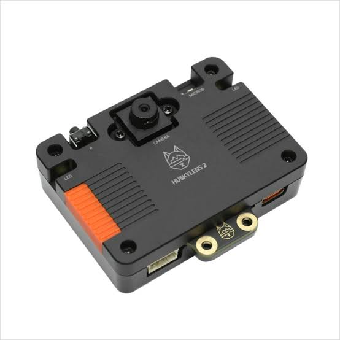
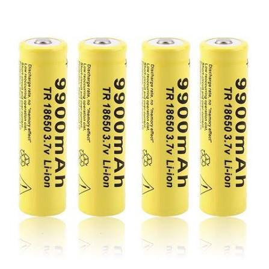
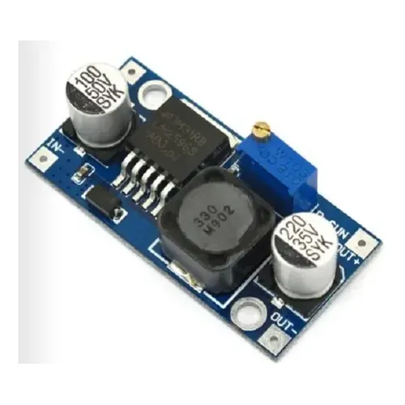

# Índice

# Índice

* [1. Nuestro Equipo](#1-nuestro-equipo)
  * [1.1 Integrantes](#11-integrantes)
  * [1.2 Nuestro Objetivo](#12-nuestro-objetivo)
  * [1.3 Contenido de la carpetas](#13-contenido-de-las-carpetas)
* [2. El Robot y Diseño Mecánico](#2-el-robot-y-diseño-mecánico)
  * [2.1 Chasis y Estructura](#21-chasis-y-estructura)
  * [2.2 Sistema de Dirección](#22-sistema-de-dirección)
  * [2.3 Sistema de Tracción](#23-sistema-de-tracción)
  * [2.4 Fotos del vehículo](#23-fotos-del-vehículo)
* [3. Apartado Electrónico](#3-apartado-electrónico)
  * [3.1 Microcontrolador y Sensores](#31-microcontrolador-y-sensores)
  * [3.2 Controlador de Motores](#32-controlador-de-motores)
  * [3.3 Baterías y Alimentación](#33-baterías-y-alimentación)
  * [3.4 Esquemas de Conexión](#34-esquemas-de-conexión)
* [4. Software y Control](#4-software-y-control)
  * [4.1 Visión Artificial](#41-visión-artificial)
  * [4.2 Algoritmo de Navegación](#42-algoritmo-de-navegación)
  
---

## 1. Nuestro Equipo
Somos Kairos, un grupo de estudiantes universitarios dedicados a la robótica, la automatización y la innovación tecnológica. 
### 1.1 Integrantes
<table>
  <tr>
    <td width="30%" valign="top">
      
    </td>
    <td valign="top">
      <h3>Rosalba Rodríguez</h3>
      
🎂 <b>Edad:</b> [21] años

      
🧑‍💻 <b>Rol:</b> Hardware / Electrónica

      

      
🔩 <b>Habilidades:</b>

      <ul>
        <li>Estudiante de Ing. Electrónica (Mención Automatización y Control).</li>
        <li>Desarrollo de sistemas de control para robótica autónoma.</li>
      </ul>
      

    </td>
  </tr>
</table>
<table>
  <tr>
    <td width="30%" valign="top">
      
    </td>
    <td valign="top">
      <h3>Victoria Perozo</h3>
      
🎂 <b>Edad:</b> [20] años

      
🧑‍💻 <b>Rol:</b> Documentación y Hardware / Electrónica

      

      
🔩 <b>Habilidades:</b>

      <ul>
        <li>Estudiante de Ing. Electrónica (Mención Telecomunicaciones).</li>
        <li>Diseño y simulación de circuitos electrónicos.</li>
        <li>Desarrollo de sistemas de control para robótica autónoma.</li>    </td>
  </tr>
</table>
<table>
  <tr>
    <td width="30%" valign="top">
      
    </td>
    <td valign="top">
      <h3>Ayrton Marcano</h3>
      
🎂 <b>Edad:</b> [19] años

      
🧑‍💻 <b>Rol:</b> Programación / Electrónica

      

      
🔩 <b>Habilidades:</b>

      <ul>
        <li>Estudiante de Ing. Informatica.</li>
        <li>Programación de microcontroladores y sensores.</li>
        <li>Desarrollo de sistemas de control para robótica autónoma.</li>
    </td>
  </tr>
</table>

### 1.2 Nuestro Objetivo
Este proyecto tiene como objetivo diseñar, construir y programar un robot autónomo capaz de superar una serie de desafíos de obstáculos para la competición WRO Future Engineers. El equipo Kairos se inspiró en la aplicación de principios de ingeniería y en la resolución creativa y eficiente de problemas, impulsados por la pasión por la innovación y el aprendizaje práctico. 

Buscamos desarrollar un sistema fiable y eficiente que muestre nuestras competencias técnicas y de trabajo en equipo, y que además ofrezca una experiencia formativa profunda. Para lograrlo seguimos un proceso sistemático: investigación, prototipado, pruebas de laboratorio e iteraciones continuas. Mantenemos documentación detallada para facilitar la transferencia de conocimiento y asegurar un flujo de trabajo ordenado a lo largo del proyecto

### 1.3 Contenido de las carpetas
Contenido (Github) 
### *t-photos* contiene fotos del equipo

### *v-photos* contiene 6 fotos del vehículo desde varios ángulos

### *video* contiene el archivo video.md con el enlace a nuestro canal de YouTube y los vídeos correspondientes

### *models* es para los archivos 3D que usamos para imprimir nuestras piezas

### *other* incluye otros archivos que pueden usarse para entender cómo preparar el vehículo para la competición. Incluye documentación, conjuntos de datos, especificaciones de hardware, protocolos de comunicación, descripciones, etc.

### *schemes* contiene diagramas esquemáticos de los componentes electromecánicos que ilustran todos los elementos (componentes electrónicos y motores) utilizados en el vehículo y cómo se conectan entre sí.

### *src* contiene código de software de control para todos los componentes programados para participar en la competición

## 2. El Robot y Diseño Mecánico

### 2.1 Chasis y Estructura
Detalles de la estructura del vehículo.
 Se ha diseñado e impreso en 3D un complejo sistema de suspensión delantera de brazos superpuestos (double-wishbone) con amortiguadores simulados. Esto no solo eleva el chasis, sino que garantiza que las ruedas mantengan un contacto constante y uniforme con el tapete, incluso al pasar sobre pequeñas irregularidades o cables, asegurando una tracción máxima y constante.
Chasis Modular Elevado (Imagen 0): El chasis azul impreso en 3D ahora sitúa toda la electrónica crítica (Arduino Mega, portabaterías de 18650, driver de motores L298N) por encima del eje de las ruedas. Esto libera espacio inferior y evita cualquier tipo de rozamiento.
Ruedas de Mayor Diámetro y Agarre: Se seleccionaron ruedas con un compuesto de goma con mejor coeficiente de fricción y mayor diámetro para contribuir a la elevación general y mejorar la capacidad de superar obstáculos menores.

### 2.2 Sistema de Dirección
### Servomotor: MG996R

<table>
  <tr>
    <td width="30%" valign="top" align="center">
       
      
    </td>
    <td valign="top">
      <h4>Especificaciones:</h4>
      <table>
        <tr><td><b>Velocidad de operación</b></td><td>0.14 s/60°</td></tr>
        <tr><td><b>Voltaje de operación</b></td><td>6v DC</td></tr>
        <tr><td><b>Corriente de operación</b></td><td>500 mA – 900 mA</td></tr>
        <tr><td><b>Corriente de bloqueo</b></td><td>2.5 A</td></tr>
        <tr><td><b>Par de bloqueo</b></td><td>11.0 kg·cm</td></tr>
        <tr><td><b>Material de engranajes</b></td><td>metálico</td></tr>
        <tr><td><b>Peso</b></td><td>55 g</td></tr>
        <tr><td><b>Tipo de servo</b></td><td>Estándar / Posicional (180°)</td></tr>
        <tr><td><b>Datasheet</b></td><td><a href="URL_DEL_DATASHEET" target="_blank">MG996R Tower-Pro</a></td></tr>
      </table>
    </td>
  </tr>
</table>

### Dimensión mecánica

Para hacer una buena elección se hizo la comparación con el micro-servo SG90. Aunque ambos se controlan por PWM y tienen un recorrido de 180°, el SG90 usa engranajes de plástico, opera a un voltaje de 4.8V y entrega un torque máximo de apenas 1.8 kg·cm, lo que lo hace más propenso al desgaste en sus engranajes o romperse debido al peso del chasis en movimiento, en cambio, el MG996R ofrece un torque de bloqueo que alcanza aproximadamente 11 kg·cm a 6V, por lo que dispone de un margen de trabajo mucho mayor para vencer la resistencia del sistema de varillas, la fricción del pivote y las irregularidades de la pista, lo que le da la robustez necesaria para mantener la alineación de las ruedas y reducir el desgaste en el sistema de varillas de dirección. 

### *Motivo de la elección:* 

Para la dirección del robot, elegimos el servomotor MG996R de giro estándar, por su buena resistencia mecánica y sus engranajes metálicos, que son importantes para soportar las cargas del eje delantero. Además, su control por PWM facilita conectarlo directamente con el microcontrolador, lo que permite una respuesta rápida y precisa. 

La dirección fue diseñada bajo la geometría Ackermann porque se busca que el robot tenga un giro más suave y eficiente, reduciendo el deslizamiento de las ruedas. A diferencia de un sistema de dirección paralela, esta configuración mejora la maniobrabilidad en espacios pequeños y ayuda a mantener una alineación más exacta al estacionar o esquivar obstáculos. 

### *Justificación técnica:* 

Utilizamos un sistema de dirección Ackermann diseñado y fabricado a medida mediante impresión 3D. Este mecanismo permite que las ruedas delanteras giren con ángulos ligeramente diferentes en cada curva, de modo que ambas sigan trayectorias concéntricas hacia un mismo punto sobre el eje trasero. Esta configuración mejora la estabilidad y la precisión en los giros cerrados. El diseño fue ajustado de forma interactiva en FreeCAD, modificando los puntos de giros y los ángulos de dirección hasta lograr una aproximación adecuada a la configuración Ackermann. 

La calibración del sistema se realizó verificando la posición neutra del servomotor antes del montaje definitivo, es decir, lo primero que se realizó fue conectar el servo al Arduino y ordenarle un ángulo de 90° antes de su montaje, para así asegurar que el motor estuviera centrado y no forzar ni romper las piezas. Con el servo fijo en ese punto, se procedió al montaje del brazo de dirección y acoplamiento de las varillas de la geometría Ackermann intentando que las ruedas delanteras quedaran lo más centradas posible. A partir de esa referencia, se hicieron pruebas en la pista y ajustes en el código para corregir desviaciones y asegurar que el giro a ambos lados fuera simétrico. De esta manera, se aseguró que el sistema quedara centrado y que las correcciones de dirección respondieran con precisión a las órdenes del microcontrolador.  

La geometría Ackermann fue adaptada a las dimensiones y curvas de la pista para asegurar que el vehículo tuviera buena reacción a las curvas cerradas y la mínima pérdida de adherencia posible. Por consiguiente, se ajustaron los ángulos de dirección y la posición de los puntos de giro en el modelo impreso en 3D, buscando que las ruedas delanteras trazaran una trayectoria coherente con el radio de curvatura de la pista durante las maniobras. Este ajuste permitió mejorar la estabilidad del robot, especialmente en cambios de dirección bruscos y en el paso por obstáculos. 
 
### *Cálculos:* 

### Ecuación Fundamental
cot(θ o ) - cot(θ i ) = W / L

W : Distancia entre pivotes de dirección (batalla)
L : Distancia entre ejes

### Relación de Velocidades en Curva
ω o / ω i = (R + W/2) / (R - W/2)

ω o : Velocidad angular de la rueda exterior.
ω i : Velocidad angular de la rueda interior.
R : Radio de giro del centro del eje.

### *Montaje:* 

El servomotor está en una plataforma de soporte frontal integrada en el chasis, la cual conecta con el varillaje del mecanismo de dirección.  El diseño modular permite realizar ajustes o cambios de componentes de manera sencilla. 

### 2.3 Sistema de Tracción
### Motor: Motorreductor DC

<table>
  <tr>
    <td width="30%" valign="top" align="center">
       
      
    </td>jp
    <td valign="top">
      <h4>Especificaciones:</h4>
      <table>
        <tr><td><b>Voltaje</b></td><td>12v DC</td></tr>
        <tr><td><b>Velocidad sin carga (RPM)</b></td><td>200rpm</td></tr>
        <tr><td><b>Par de motor de pérdida</b></td><td>1.7 kg-cm</td></tr>
        <tr><td><b>Par máximo de eficiencia</b></td><td>0.34 kg-cm</td></tr>
        <tr><td><b>Relación de cambios</b></td><td>1:100</td></tr>
        <tr><td><b>Corriente nominal</b></td><td>0.04 A</td></tr>
        <tr><td><b>Corriente de pérdida</b></td><td>0.67 A</td></tr>
        <tr><td><b>Material de engranajes</b></td><td>metálico</td></tr>
        <tr><td><b>Datasheet</b></td><td><a href="https://www.bolanosdj.com.ar/MOVIL/ARDUINO2/MotoresConRuedasArd.pdf" target="_blank">MotoresConRuedasArd.pdf</a></td></tr>
      </table>
    </td>
  </tr>
</table>

### Dimensión mecánica

### *Motivo de la elección*

El motorreductor amarillo DC fue seleccionado por su diseño ligero, económico y su facilidad de integración dentro de nuestro chasis. Su caja reductora integrada permite una transmisión directa y eficiente hacia las ruedas, proporcionando el par necesario para mantener una buena tracción en pistas planas dentro de una arquitectura modular.

Al no contar con un encoder (codificador) integrado para el conteo de vueltas, se incorporó un giroscopio que ofrece una retroalimentación de movimiento precisa. Esto asegura que los desplazamientos del robot sean exactos, compensando la ausencia de sensores de efecto Hall y reduciendo el margen de error al tomar curvas cerradas.

### *Justificación técnica* 

Elegimos el motorreductor amarillo DC con su relación de reducción interna (1:48) porque nos ofrece el balance ideal entre torque, velocidad de respuesta y consumo energético. Esta configuración permite alcanzar la velocidad requerida en las ruedas para que los sensores de visión artificial y los sensores ultrasónicos ejecuten la captura y el procesamiento de datos en tiempo real con alta estabilidad, evitando desincronizaciones en las lecturas durante los giros.

Utilizando los modelos de transferencia de torque y considerando el peso total del chasis junto con la fricción de los ejes, los cálculos determinan que el torque requerido para vencer la fricción estática inicial y poner en marcha el robot se encuentra muy por debajo del torque máximo de pérdida especificado para estos motores. Este margen garantiza un factor de seguridad óptimo sobre el torque mínimo de arranque, asegurando que los motores operen de forma continua en su zona de mayor eficiencia sin sobrecalentamiento.

### *Diferencial de engranaje (Diseño principal)*

Originalmente se diseñó un sistema de engranajes diferencial impreso en 3D para ser acoplado al conjunto del motorreductor amarillo. Este mecanismo permitiría que las ruedas traseras (izquierda y derecha) giraran a velocidades independientes durante las curvas, optimizando el desplazamiento fluido y mejorando la estabilidad del robot en giros exigentes. Sin embargo, debido a fallos en la manufactura de las piezas mecánicas, no fue posible su implementación en el prototipo final.
Solución del diseño

Durante la fase de ensamblaje se identificó un error de tolerancia en la impresión de los engranajes internos del diferencial (el anillo y los piñones satélite). Ante la imposibilidad de reimprimir estas piezas a tiempo para las pruebas, se sustituyó la caja del diferencial por un sistema de transmisión de eje rígido directo.

Aunque esta modificación elimina la capacidad mecánica de variar la velocidad entre ambas ruedas al girar, el efecto se compensa a través de código: el software utiliza los datos del giroscopio para ajustar la aceleración y gestionar electrónicamente la trayectoria del vehículo en las curvas.

### Fotos del vehículo

### 1.2 Imágenes del Robot

<table>
  <tr>
    <td align="center">
      <b>Vista frontal</b> 
      
    </td>
    <td align="center">
      <b>Vista posterior</b> 
      
    </td>
    <td align="center">
      <b>Vista lateral izquierda</b> 
      
    </td>
  </tr>
  <tr>
    <td align="center">
      <b>Vista lateral derecha</b> 
      
    </td>
    <td align="center">
      <b>Vista superior</b> 
      
    </td>
    <td align="center">
      <b>Vista inferior</b> 
      
    </td>
  </tr>
</table>

## 3. Apartado Electrónico
### 3.1 Microcontrolador y Sensores
### Microcontrolador: Arduino Mega2560

<table>
  <tr>
    <td width="30%" valign="top" align="center">
       
      
    </td>
    <td valign="top">
      <h4>Especificaciones:</h4>
      <table>
        <tr><td><b>Microcontrolador</b></td><td>ATmega2560</td></tr>
        <tr><td><b>Coprocesador Inalámbrico</b></td><td>ESP8266 integrado (Para conectividad WiFi)</td></tr>
        <tr><td><b>Voltaje de operación</b></td><td>5 V DC</td></tr>
        <tr><td><b>Voltaje de Entrada</b></td><td>7V a 12V DC</td></tr>
        <tr><td><b>Pines I/O Digitales</b></td><td>54 (de los cuales 15 proporcionan salida PWM)</td></tr>
        <tr><td><b>Pines de Entrada Analógica</b></td><td>16</td></tr>
        <tr><td><b>Memoria Flash</b></td><td>256 KB (de los cuales 8 KB son usados por el bootloader)</td></tr>
        <tr><td><b>Memoria SRAM / EEPROM</b></td><td>8 KB / 4 KB</td></tr>
        <tr><td><b>Datasheet</b></td><td><a href="https://admin.arsbook.it/stempdf/LS-ELEGOO-MEGA.pdf" target="_blank">LS-ELEGOO-MEGA.pdf</a></td></tr>
      </table>
    </td>
  </tr>
</table>

### Motivo de la selección

El Arduino Mega 2560 actúa como el cerebro central de procesamiento de nuestro robot. Su arquitectura basada en el microcontrolador ATmega2560 ofrece una ejecución de muy baja latencia, lo cual resulta indispensable para responder en tiempo real a las lecturas del giroscopio MPU6050, el procesamiento del sistema de visión artificial y la evasión instantánea de obstáculos mediante los sensores ultrasónicos.

Elegimos esta tarjeta debido a la alta demanda de recursos de nuestra arquitectura electrónica y de control. Al integrar simultáneamente la cámara de visión artificial, los sensores ultrasónicos, el módulo IMU MPU6050, el servomotor de dirección y el driver de tracción, placas más compactas habrían agotado rápidamente sus pines disponibles y su memoria de trabajo. Además, este modelo incorpora un coprocesador inalámbrico ESP8266 integrado, lo que nos otorga conectividad WiFi para la transmisión de telemetría sin recargar las tareas principales del procesador central. Sus 54 pines digitales, 16 entradas analógicas y 4 puertos UART por hardware nos dan total libertad para mantener un esquema de cableado modular, ordenado y directo.

### Comparación con Arduino Uno y Nano

Al comparar la tarjeta seleccionada con un Arduino Uno o Nano tradicional, la diferencia más crítica radica en la capacidad de memoria y procesamiento. El Arduino Mega 2560 cuenta con 256 KB de memoria Flash y 8 KB de memoria SRAM, lo que representa hasta ocho veces más espacio para alojar algoritmos de control de trayectoria, cálculos de visión y librerías complejas sin correr el riesgo de colapsar la memoria del sistema durante la ejecución en pista.

Otra ventaja determinante es la disponibilidad de periféricos por hardware. Mientras que placas como el Uno poseen un solo puerto serie, el Mega 2560 ofrece 4 puertos UART independientes por hardware, lo que permite la comunicación simultánea con la cámara de visión y el monitor de depuración sin recurrir a emulaciones por software. Asimismo, sus 54 pines de entrada/salida digital evitan la saturación del controlador al conectar múltiples sensores y actuadores de forma dedicada, sumado a la conectividad WiFi integrada mediante el chip ESP8266 que no está presente en los modelos convencionales.

### Justificación de la ubicación

El Arduino Mega 2560 se posicionó en el centro geométrico del chasis con el objetivo principal de garantizar su protección estructural. Al ubicarse en la zona interna más resguardada del vehículo, la tarjeta queda protegida frente a posibles colisiones directas o roces accidentales contra las paredes del circuito durante la navegación.

Adicionalmente, esta posición estratégica optimiza la distribución general del cableado. Estar en el centro minimiza la distancia física hacia los componentes de la sección frontal (como la cámara de visión, el servomotor de dirección y los sensores ultrasónicos) y hacia la sección trasera (donde se encuentran el driver de potencia y el motor de tracción). Esto no solo ayuda a reducir el peso total de los cables y a equilibrar las masas del robot, sino que también disminuye notablemente el riesgo de interferencias electromagnéticas en las líneas de transmisión de datos.
Cámara, MPU6050, sensores ultrasónicos, etc.

### Sensor Ultrasónico: HC-SR04

<table>
  <tr>
    <td width="30%" valign="top" align="center">
       
      
    </td>
    <td valign="top">
      <h4>Especificaciones:</h4>
      <table>
        <tr><td><b>Modelo</b></td><td>HC-SR04</td></tr>
        <tr><td><b>Voltaje</b></td><td>5 V DC</td></tr>
        <tr><td><b>Corriente de trabajo</b></td><td>15 mA</td></tr>
        <tr><td><b>Corriente de reposo</b></td><td>&lt; 2mA</td></tr>
        <tr><td><b>Rango de medición</b></td><td>2 cm a 400 cm</td></tr>
        <tr><td><b>Ángulo de apertura</b></td><td>&lt; 15° (Cono de medición)</td></tr>
        <tr><td><b>Datasheet</b></td><td><a href="URL_DEL_DATASHEET" target="_blank">ULTRASONIC-HC-SR04.PDF</a></td></tr>
      </table>
    </td>
  </tr>
</table>

### Dimensiones mecánicas

### Motivo de la elección: 

Hemos integrado dos sensores ultrasónicos para la navegación en entornos con obstáculos, estos sensores son importantes para la detección de distancias de seguridad para evitar colisiones. El funcionamiento de estos dispositivos se basa en la emisión de pulsos sonoros y la medición del tiempo de retorno, lo que permite calcular la distancia a paredes o pilares con alta precisión, sin depender de las condiciones de luz, proporcionando seguridad para tareas como el aparcamiento en paralelo. 

Estos sensores ofrecen una ventaja competitiva frente a los infrarrojos, ya que al no depender de la iluminación del entorno permite una detección constante sobre cualquier tipo de material. Además, al tener una fácil conexión con el microcontrolador, permite una rápida integración. 

### Justificación de la ubicación: 

La aplicación de los ultrasónicos consta de tres sensores posicionados a los costados y al frente del robot, uno en el lado izquierdo y otro en el lado derecho. Esta distribución se aplica para compensar las zonas ciegas y complementar el campo de visión de la cámara. 

Al colocar la cámara en la parte frontal para el reconocimiento de colores y líneas de carrera, sus laterales se convierten en puntos ciegos en el campo de visión, debido al ángulo de su lente. Por ello, se decidió colocar los sensores posicionados hacia los laterales y al frente, para que cubran los puntos críticos de visión durante el recorrido, esta configuración nos ayuda a ejecutar maniobras como el aparcamiento en paralelo o la evasión de pilares en curvas cerradas, ya que permite medir la distancia de las paredes de la pista.

### Sensor de Orientación: Giroscopio

<table>
  <tr>
    <td width="30%" valign="top" align="center">
       
      
    </td>
    <td valign="top">
      <h4>Especificaciones:</h4>
      <table>
        <tr><td><b>Modelo</b></td><td>MPU6050 (Acelerómetro + Giroscopio de 6 ejes)</td></tr>
        <tr><td><b>Voltaje</b></td><td>3.3 V a 5 V DC</td></tr>
        <tr><td><b>Corriente de operación</b></td><td>3.9 mA</td></tr>
        <tr><td><b>Protocolo de comunicación</b></td><td>I2C (pines SDA y SCL)</td></tr>
        <tr><td><b>Convertidores Analógico-Digital (ADC)</b></td><td>De 16 bits para cada eje</td></tr>
        <tr><td><b>Datasheet</b></td><td><a href="URL_DEL_DATASHEET" target="_blank">ps-mpu-6000a-00-mpu-6000-and-mpu-6050-datasheet.pdf</a></td></tr>
      </table>
    </td>
  </tr>
</table>

### Diagrama de bloque interno 

### Motivo de la selección

El módulo MPU6050 es de suma importancia para la navegación y el control de rumbo de nuestro robot, especialmente debido a que nuestra configuración de tracción con el motorreductor amarillo DC no cuenta con encoders para medir directamente las revoluciones o vueltas de las ruedas, ante esta limitación, la Unidad de Medida Inercial (IMU) proporciona lecturas en tiempo real sobre la velocidad angular y el ángulo de orientación (yaw), permitiendo que el sistema realice correcciones continuas para mantener el rumbo o ejecutar giros exactos.

Elegimos el MPU6050 por ser una solución compacta e integral, ya que reúne en un solo chip un giroscopio de 3 ejes y un acelerómetro de 3 ejes, ofreciendo un sistema de navegación inercial completo de 6 grados de libertad (6-DOF). La mayor ventaja técnica de este módulo es su procesador interno Digital Motion Processor (DMP), el cual ejecuta de forma autónoma los cálculos matemáticos pesados para el filtrado de ruido y fusión de datos. Gracias a esto, el MPU6050 entrega los datos de orientación ya procesados y limpios, liberando de esa carga de trabajo a nuestro Arduino Mega 2560.

### Comparación con otras alternativas de orientación

Al comparar el MPU6050 con el uso de sensores individuales o con brújulas digitales magnéticas (como el HMC5883L), el MPU6050 presenta ventajas superiores de integración y precisión en robótica móvil. Las brújulas magnéticas son altamente susceptibles a las interferencias electromagnéticas generadas por el propio motorreductor amarillo DC en funcionamiento y por el cableado de potencia, lo que provoca desviaciones severas en la lectura de dirección. Al ser puramente inercial, el MPU6050 no se ve afectado por campos magnéticos externos.

Por otro lado, implementar sensores de inclinación o aceleración independientes requeriría mayor cableado en el bus I2C y obligaría al microcontrolador a ejecutar manualmente algoritmos de filtrado pesados (como el filtro de Kalman o complementario), consumiendo memoria y ciclos de procesamiento. El MPU6050 resuelve esto mediante su DMP interno, representando la opción más equilibrada entre precisión, bajo consumo y eficiencia de procesamiento.

### Justificación de la ubicación

El MPU6050 se ubicó en la zona central del chasis, situándose lo más cerca posible del centro de masa y del eje geométrico de rotación del robot. Esta ubicación es crítica, ya que situar el giroscopio lejos del centro de giro introduce aceleraciones centrípetas parasitarias durante las curvas, deformando las lecturas.
Adicionalmente, al estar montado de forma rígida sobre una sección estable del chasis, se reducen las vibraciones mecánicas generadas por el motorreductor amarillo y la rodadura, asegurando una transmisión constante de datos estables a través de las líneas de comunicación I2C.

### Cámara de Visión Artificial: HuskyLens 2

<table>
  <tr>
    <td width="30%" valign="top" align="center">
       
      
    </td>
    <td valign="top">
      <h4>Especificaciones:</h4>
      <table>
        <tr><td><b>Procesador principal</b></td><td>Kendryte K230 Dual-Core a 1.6 GHz</td></tr>
        <tr><td><b>Sensor de imagen</b></td><td>GC2093 de 2.0 Megapíxeles (1/2.9", hasta 60 FPS)</td></tr>
        <tr><td><b>Pantalla</b></td><td>IPS táctil capacitiva de 2.4" (Resolución 640 × 480)</td></tr>
        <tr><td><b>Memoria</b></td><td>1 GB LPDDR4 RAM + 8 GB eMMC Flash</td></tr>
        <tr><td><b>Voltaje de operación</b></td><td>3.3V a 5.0V DC (a través del puerto Gravity o USB-C)</td></tr>
        <tr><td><b>Consumo de Corriente</b></td><td>1.5W – 3W (aprox. 300 mA a 600 mA a 5V)</td></tr>
        <tr><td><b>Tipo de Lente</b></td><td>Módulo intercambiable de lente modular</td></tr>
        <tr><td><b>Interfaces de datos</b></td><td>UART serial (baud rates 9600, 115200), I2C (dirección default 0x50), USB-C y Wi-Fi 6 (módulo opcional)</td></tr>
        <tr><td><b>Datasheet</b></td><td><a href="https://www.farnell.com/datasheets/3178377.pdf" target="_blank">3178377.pdf</a></td></tr>
      </table>
    </td>
  </tr>
</table>

### Motivo de la selección

La cámara de visión artificial HuskyLens 2 actúa como el sensor primario de percepción visual de nuestro robot. A diferencia de las cámaras convencionales, cuenta con un procesador dedicado Kendryte K230 Dual-Core a 1.6 GHz con aceleración por Inteligencia Artificial que procesa las imágenes internamente a 60 FPS. Esto permite detectar y rastrear objetos, firmas de color y marcadores visuales con alta precisión sin recargar de procesamiento al microcontrolador principal Arduino Mega 2560. Su diseño compacto y ligereza facilitan una integración eficiente en la estructura, utilizándose principalmente para:

 * Identificar y diferenciar el color y tipo de pilares u obstáculos en la pista.
 * Seguir líneas de ruta y límites del circuito.
 * Reconocer zonas de maniobra, señales y marcadores visuales en tiempo real.
 * 
### Comparación con la PixyCam2

Al comparar la HuskyLens 2 con la PixyCam2, la diferencia técnica más destacada se encuentra en la potencia de procesamiento y las capacidades de Inteligencia Artificial en el borde (Edge AI). Mientras que la PixyCam2 utiliza un procesador NXP dual-core a 204 MHz enfocado en la filtración de color por tono y saturación, la HuskyLens 2 integra un procesador Kendryte K230 a 1.6 GHz respaldado por 1 GB de memoria RAM LPDDR4 y 8 GB de almacenamiento eMMC. Esta diferencia de capacidad computacional permite a la HuskyLens 2 ejecutar modelos de visión e inferencias de IA significativamente más complejas y estables ante variaciones de escena.

Otra ventaja operativa determinante es la presencia de su pantalla táctil IPS de 2.4 pulgadas. La PixyCam2 carece de pantalla integrada, lo que obliga a conectar la cámara a una computadora portátil mediante el software PixyMon para ajustar o reentrenar algoritmos. En cambio, la HuskyLens 2 permite realizar la calibración, el aprendizaje de nuevas firmas de color y el ajuste de parámetros de detección directamente en la cámara mediante su interfaz táctil, acelerando drásticamente la puesta a punto del robot en la pista de competencia.

### Justificación de la ubicación y calibración

La HuskyLens 2 se montó de forma rígida en la parte frontal del vehículo sobre un soporte elevado. Esta posición otorga a la lente un ángulo despejado de la pista, permitiendo captar colores, referencias y límites sin que el chasis o el sistema de dirección obstaculicen la toma de imagen. La elevación estratégica permite anticipar las curvas, detectar con suficiente margen de distancia los pilares de color y enviar los datos de posición al Arduino para ejecutar giros suaves y precisos.
Para evitar errores de detección causados por variaciones en la iluminación del recinto (que suelen alterar la visión espectral y la temperatura de color), la cámara se calibra previamente a las pruebas.

### 3.2 Controlador de Motores
### Módulo Driver de Motores: Puente H L298N

<table>
  <tr>
    <td width="30%" valign="top" align="center">
       
      
    </td>
    <td valign="top">
      <h4>Especificaciones:</h4>
      <table>
        <tr><td><b>Modelo</b></td><td>L298n (Módulo Driver Puente H Dual)</td></tr>
        <tr><td><b>Voltaje de entrada</b></td><td>5 V – 35 V (para los motores)</td></tr>
        <tr><td><b>Voltaje de lógica</b></td><td>5 V (para el Arduino)</td></tr>
        <tr><td><b>Corriente máxima</b></td><td>2A por canal</td></tr>
        <tr><td><b>Corriente continua</b></td><td>1A – 1.5A por motor (recomendado)</td></tr>
        <tr><td><b>Potencia máxima disipada</b></td><td>25W</td></tr>
        <tr><td><b>Motores controlables</b></td><td>2 motores DC o 1 paso a paso (bipolar)</td></tr>
        <tr><td><b>Datasheet</b></td><td><a href="URL_DEL_DATASHEET" target="_blank">Datasheet - L298 - Dual full-bridge driver</a></td></tr>
      </table>
    </td>
  </tr>
</table>

### Motivo de la elección

Para la gestión de la movilidad y el sistema de tracción, optamos por el módulo L298N como el puente H encargado de regular la velocidad mediante modulación por ancho de pulso (PWM) y el sentido de giro de nuestro motorreductor amarillo DC. Este módulo trabaja recibiendo señales de control de baja potencia desde el microcontrolador y las amplifica mediante su etapa de potencia para suministrar el voltaje adecuado al motor de tracción. Seleccionamos este componente por su plena compatibilidad con los niveles lógicos de 5V del Arduino Mega 2560, lo que garantiza una comunicación directa sin necesidad de acondicionadores de señal ni adaptadores de nivel.

Adicionalmente, el L298N nos facilita el montaje modular dentro del chasis gracias a sus borneras de tornillo integradas y a su robusto disipador térmico de aluminio. Estas ventajas mecánicas permiten asegurar las conexiones de alta corriente fuertemente con un destornillador, logrando un acople firme que previene desconexiones accidentales por vibración en la pista. Esto protege la estabilidad de toda la arquitectura electrónica, asegurando un suministro eléctrico aislado respecto a componentes sensibles como la cámara de visión artificial HuskyLens 2, el módulo inercial MPU6050 y los sensores ultrasónicos HC-SR04.

### Comparación con otros drivers de motores

Al comparar el L298N con alternativas populares como el driver TB6612FNG o el módulo L9110S, la principal ventaja para nuestro proyecto radica en la disipación térmica y la robustez mecánica. El TB6612FNG utiliza MOSFETs de mayor eficiencia que reducen la caída de voltaje interna; sin embargo, al ser un chip compacto de montaje superficial, no incluye conectores de bornera integrados. Conectar los cables exige soldadura directa o pines finos que resultan frágiles ante las vibraciones mecánicas continuas del vehículo.

Por otro lado, el módulo L9110S es de menor tamaño pero carece de un disipador de calor dedicado, lo que limita su capacidad para soportar picos de corriente bajo exigencia continua. El L298N destaca sobre ambas opciones por su capacidad de disipar corriente constante de hasta 2A por canal, su protección contra sobrecalentamiento gracias a su disipador integrado y la facilidad de mantenimiento que aportan sus terminales roscadas, convirtiéndolo en la opción más confiable para soportar la carga eléctrica del motorreductor amarillo DC a 12V.
Justificación técnica y gestión de potencia

Se tomó la decisión de implementar el driver L298N para separar de forma efectiva la etapa de potencia de la etapa de lógica de control. Al alimentar el motorreductor amarillo DC directamente desde la batería a través del puente H, evitamos que las corrientes parásitas y el ruido inductivo generados por el motor se propaguen hacia la línea regulada de 5V del Arduino Mega 2560.

Esta separación es fundamental para prevenir caídas de voltaje momentáneas que podrían provocar reinicios indeseados en la cámara HuskyLens 2 o causar pérdidas de sincronización en el bus de comunicación I2C de la IMU MPU6050. Asimismo, la capacidad de disipación del L298N nos permite aplicar rampas de aceleración y frenado dinámico por software manteniendo una temperatura de operación estable dentro del rango óptimo de trabajo.

### 3.3 Baterías y Alimentación

### Baterías: Li-Ion 18650

<table>
  <tr>
    <td width="30%" valign="top" align="center">
       
      
    </td>
    <td valign="top">
      <h4>Especificaciones:</h4>
      <table>
        <tr><td><b>Capacidad nominal</b></td><td>3200 mAh</td></tr>
        <tr><td><b>Voltaje nominal</b></td><td>3,6V DC</td></tr>
        <tr><td><b>Rango de voltaje de operación</b></td><td>4.20V (Carga completa) - 2.5V (Descarga límite)</td></tr>
        <tr><td><b>Corriente de carga máxima</b></td><td>2200 mA</td></tr>
        <tr><td><b>Corriente de descarga máxima</b></td><td>4400 mA</td></tr>
        <tr><td><b>Peso de la celda</b></td><td>44,5g</td></tr>
        <tr><td><b>Datasheet</b></td><td><a href="URL_DEL_DATASHEET" target="_blank">Technical Information NCR18650BF.pdf</a></td></tr>
      </table>
    </td>
  </tr>
</table>

> [!WARNING]
> Nota sobre la capacidad real de las baterías
> 
> Aunque en las baterías se visualiza que poseen una capacidad de 9800 mAh, este valor no suele corresponder a la capacidad real de una pila individual, por lo que, en la práctica, las celdas 18650 confiables tienen una capacidad entre 2200 y 3500 mAh. Hay que tomar en cuenta que las marcas genéricas exageran esa etiqueta con fines publicitarios.

### Motivo de la elección

Las baterías de iones de litio 18650 son la opción más eficiente y rentable para el sistema de energía del robot, ofreciendo una alta densidad energética en un formato compacto y de bajo peso. Cada celda pesa aproximadamente 44,5 gramos y es capaz de entregar corrientes de descarga continua de hasta 4400 mA, lo que garantiza el suministro necesario para cubrir la demanda simultánea del motorreductor amarillo DC, el servomotor MG996R de la dirección, la cámara de visión artificial HuskyLens 2 y los sensores del sistema.

Su química de Li-Ion proporciona un voltaje nominal constante y una curva de descarga estable en comparación con tecnologías tradicionales, garantizando que los circuitos lógicos y los actuadores mantengan un rendimiento óptimo durante todo el tiempo de recorrido en la pista.
Comparación con otras tecnologías de alimentación

Al evaluar diferentes alternativas de almacenamiento de energía para robótica móvil, las celdas 18650 presentan claras ventajas frente a las baterías alcalinas tradicionales, las baterías de NiMH y los paquetes de LiPo (Polímero de Litio):

 * Frente a Baterías Alcalinas / NiMH (AA): Las baterías AA ofrecen una baja densidad de energía y una marcada caída de voltaje bajo consumos elevados. Se requerirían múltiples celdas AA para alcanzar el voltaje de operación del sistema, lo que incrementaría drásticamente el peso del robot y reduciría el tiempo de autonomía.
 * Frente a Baterías LiPo: Aunque las baterías LiPo ofrecen tasas de descarga muy altas, su envoltura blanda las hace vulnerables a perforaciones o daños mecánicos en caso de colisión. Además, requieren cuidados rigurosos de almacenamiento y carga. Las celdas 18650 cuentan con un blindaje metálico cilíndrico rígido que ofrece mayor seguridad estructural dentro del chasis.
 * Frente a Powerbanks USB: Un powerbank comercial limita la salida a 5V regulados mediante circuitos internos que pueden cortar el suministro ante picos repentinos de corriente generados por el servomotor o el motor de tracción. El uso directo de celdas 18650 permite acceder al potencial completo de voltaje de la batería sin restricciones de corriente de protección externas.
   
### Justificación del sistema de alimentación

A diferencia de configuraciones con doble fuente de alimentación, el sistema utiliza un único paquete de baterías 18650 conectadas en serie como fuente centralizada de energía. Esta configuración unificada simplifica la arquitectura eléctrica del robot, reduce el peso total del chasis y optimiza el espacio interno.

El paquete en serie suministra directamente el voltaje de línea principal al módulo driver L298N para energizar la etapa de tracción. A su vez, esta misma línea principal alimenta al microcontrolador Arduino Mega 2560 a través de su puerto de entrada VIN, utilizando sus reguladores internos y los sistemas de conversión para distribuir un voltaje limpio y estable hacia la cámara HuskyLens 2, el giroscopio MPU6050, el servomotor MG996R y los sensores ultrasónicos HC-SR04.

Esta centralización disminuye los puntos de falla en el cableado, facilita el proceso de recarga mediante un único punto de conexión e incluye un interruptor general de corte para proteger la química de las baterías y permitir un encendido y apagado rápido y seguro.
Justificación de la ubicación

El paquete de baterías se posicionó estratégicamente en el costado trasero del chasis. Esta ubicación responde principalmente a la necesidad de equilibrar la distribución de pesos del vehículo:

 * Balance del centro de gravedad: Al estar montados en la sección frontal componentes de peso considerable como el servomotor de dirección MG996R, el soporte de la dirección y la cámara HuskyLens 2, ubicar la batería en el costado trasero compensa la carga sobre el tren delantero, mejorando la tracción de las ruedas traseras y evitando derrapes no deseados en las curvas.

   ### Regulador de Voltaje: LM2596S

<table>
  <tr>
    <td width="30%" valign="top" align="center">
       
      
    </td>
    <td valign="top">
      <h4>Especificaciones:</h4>
      <table>
        <tr><td><b>Modelo</b></td><td>LM2596S (Módulo DC-DC Step-Down)</td></tr>
        <tr><td><b>Voltaje de entrada</b></td><td>3.2V a 40V DC</td></tr>
        <tr><td><b>Voltaje de salida</b></td><td>1.25V a 35V DC (Ajustable mediante trimpot)</td></tr>
        <tr><td><b>Corriente de salida</b></td><td>2A continua (hasta 3A con disipador)</td></tr>
        <tr><td><b>Eficiencia de conversión</b></td><td>Hasta 92%</td></tr>
        <tr><td><b>Frecuencia de conmutación</b></td><td>150 kHz</td></tr>
        <tr><td><b>Rizado de salida</b></td><td>&lt; 30 mV</td></tr>
        <tr><td><b>Datasheet</b></td><td><a href="https://agelectronica.lat/pdfs/textos/L/LM2596S-DC-DC-MODULE.PDF" target="_blank">LM2596S-DC-DC-MODULE.PDF</a></td></tr>
      </table>
    </td>
  </tr>
</table>

### Motivo de la elección

El módulo regulador conmutado paso a paso (Step-Down Buck) LM2596S fue seleccionado como la columna vertebral de la gestión de voltaje de nuestro robot debido a su alta eficiencia energética (hasta un 92%) y su capacidad para entregar hasta 3A de corriente pico. Dado que el paquete de baterías Li-Ion 18650 suministra un voltaje superior al requerido por los componentes electrónicos, el LM2596S permite reducir y estabilizar dicha tensión con una generación mínima de calor.

Para garantizar un rendimiento óptimo y prevenir fallos eléctricos, se implementó una arquitectura de regulación dual integrada por dos módulos LM2596S independientes:

 * Regulador 1 (Línea Lógica y Visión a 5V): Configurado a una salida constante de 5.0V para alimentar de forma segura e interrumpida la etapa de control y percepción del robot, correspondiente al Arduino Mega 2560, la cámara de visión artificial HuskyLens 2, el giroscopio MPU6050 y los sensores ultrasónicos HC-SR04.
 * Regulador 2 (Línea de Actuación a 7V): Configurado a una salida dedicada de 7.0V exclusivamente para el servomotor de dirección MG996R. Esto permite exprimir al máximo el torque y la velocidad de respuesta del servo (cuyo límite recomendado ronda los 7.2V) sin comprometer ni sobrecargar la línea de 5V de los componentes sensibles.
   
### Comparación con otras soluciones de regulación

Al comparar el LM2596S con reguladores lineales tradicionales (como el regulador interno del Arduino, el LM7805 o el AMS1117), la principal desventaja de los sistemas lineales radica en que convierten todo el exceso de voltaje en calor mediante disipación. Alimentar componentes de alto consumo como la HuskyLens 2 o el servomotor desde un regulador lineal provocaría sobrecalentamiento inmediato, cortes por protección térmica o caídas drásticas de tensión. El LM2596S, al ser un regulador conmutado de 150 kHz, aprovecha la energía con pérdidas insignificantes de temperatura.

Por otro lado, al evaluar la alternativa de utilizar un único regulador central de 5V para todo el sistema, esta opción presenta severas limitaciones operativas: por un lado, limitaría el rendimiento del servomotor MG996R al hacerlo operar a un voltaje menor (perdiendo fuerza de giro y rapidez de respuesta); por otro lado, crearía un riesgo constante de brownouts (reinicio imprevisto del Arduino o de la cámara) producidos por las caídas bruscas de voltaje que exige el servo en situaciones de alta resistencia mecánica.

#### Justificación técnica y aislamiento de cargas

La decisión estratégica de separar la regulación en dos módulos independientes resuelve de raíz el problema de los picos de corriente e inducción electromagnética producidos por el servomotor. Durante los cambios bruscos de dirección o el sostenimiento del ángulo de las ruedas, el servomotor demanda pulsos elevados de corriente que pueden distorsionar la línea de alimentación. Al contar con un LM2596S ajustado exclusivamente a 7V para la dirección, dichos picos de corriente quedan confinados en esa etapa, protegiendo totalmente la estabilidad del bus de 5V.
Asimismo, la posibilidad de calibrar con precisión el voltaje de salida del segundo regulador a 7V proporciona una ventaja competitiva en pista: el servomotor de dirección incrementa significativamente su velocidad angular y su torque de retención en comparación con su operación estándar a 5V. Esto permite al robot ejecutar correcciones de trayectoria más rápidas y precisas al recibir las instrucciones enviadas por la cámara HuskyLens 2 y el giroscopio MPU6050.

### 3.4 Esquemas de Conexión
El conexionado eléctrico integral de potencia, distribución de buses y líneas de control de "Gedeon" fue desarrollado en Cirkitdesigner.

> [!NOTE]
> Optamos por un sistema de interconexión basado en cableado flexible (cables puente y cable UTP).

## 1. Tabla Principal de Mapeo de Pines (Arduino Mega 2560)

| Subsistema | Componente / Periférico | Pin Físico | Modo de operación / Protocolo de firmware |
| :--- | :--- | :--- | :--- |
| Dirección | Servomotor MG996R Digi High-Torque | Pin 8 | Salida PWM a 50 Hz (Control con Servo.h, rango restringido de 69° a 111°) |
| Tracción | Controlador L298N - ENA (Velocidad) | Pin 2 | Modulación PWM (analogWrite de 8 bits, 0-255) |
|  | Controlador L298N - IN1 (Sentido) | Pin 5 | Salida Digital: Estado ALTO (HIGH) para avance |
|  | Controlador L298N - IN2 (Sentido) | Pin 6 | Salida Digital: Estado BAJO (LOW) para avance / ALTO para freno |
| Orientación | Sensor Inercial IMU MPU6050 (SDA) | Pin 20 | Bus I2C - Línea de datos bidireccional (SDA a 400 kHz Fast-Mode) |
|  | Sensor Inercial IMU MPU6050 (SCL) | Pin 21 | Bus I2C - Línea de reloj (SCL a 400 kHz Fast-Mode) |
| Ultrasonido | HC-SR04 Frontal - TRIGGER | Pin 24 | Salida Digital: Disparo de pulso (10 µs) |
|  | HC-SR04 Frontal - ECHO | Pin 26 | Entrada Digital: Tiempo de retorno medido mediante pulseIn() |
|  | HC-SR04 Derecho - TRIGGER | Pin 38 | Salida Digital: Disparo de pulso (10 µs) |
|  | HC-SR04 Derecho - ECHO | Pin 37 | Entrada Digital: Tiempo de retorno medido mediante pulseIn() |
|  | HC-SR04 Izquierdo - TRIGGER | Pin 39 | Salida Digital: Disparo de pulso (10 µs) |
|  | HC-SR04 Izquierdo - ECHO | Pin 40 | Entrada Digital: Tiempo de retorno medido mediante pulseIn() |

### Cálculo de Autonomía Real en Pista

### 2.2.2 Cálculo de Autonomía Real en Pista

Considerando la capacidad real del banco de litio en configuración 3S ($V_{\text{nom}} = 11.1\text{V}$, $V_{\text{máx}} = 12.6\text{V}$) y una eficiencia promedio del $88\%$ ($\eta = 0.88$) en las conversiones Buck/Boost:

$$I_{\text{promedio}} = \frac{P_{\text{total}}}{\eta \cdot V_{\text{bus}}} = \frac{8.67\text{ W}}{0.88 \cdot 11.1\text{ V}} \approx 0.89\text{ A} \quad \text{(a plena demanda dinámica en carrera)}$$

$$T_{\text{autonomía, activo}} = \frac{3.5\text{ Ah}}{0.89\text{ A}} \approx 3.93\text{ Horas de Navegación Continua}$$

$$T_{\text{autonomía, standby}} = \frac{3.5\text{ Ah}}{0.236\text{ A}} \approx 14.8\text{ Horas de Espera en Boxes}$$

> 💡 Razonamiento del Consumo: Al operar a una tensión nominal superior ($11.1\text{V}$ con 3 celdas en serie), la demanda de corriente promedio se reduce a apenas $0.89\text{ A}$. Esto minimiza la caída por resistencia interna (*I²R*), evita el estrés térmico en las celdas y garantiza una curva de descarga extremadamente estable durante todas las mangas de competencia.

---

### Banco de Baterías 18650 3S (10.5V - 11.1V / 12.6V Máx) y Autonomía Teórica

El suministro energético de la plataforma se basa en celdas de iones de litio de alta densidad energética en arreglo de 3 celdas en serie (3S):

* Topología Eléctrica (3S): Tres celdas conectadas en serie:
  $$V_{\text{nom}} = 3 \times 3.7\text{V} = 11.1\text{V CC} \quad (V_{\text{máx}} = 3 \times 4.2\text{V} = 12.6\text{V a plena carga})$$
  $$C_{\text{total}} = 3500\text{ mAh} \quad (3.5\text{ Ah}) \implies E_{\text{disponible}} = 11.1\text{V} \times 3.5\text{ Ah} = 38.85\text{ Wh}$$

* Estabilidad de Tensión Prolongada: La configuración 3S permite trabajar más cerca del rango óptimo de regulación de los convertidores, reduciendo el trabajo de elevación de voltaje y optimizando la eficiencia global del circuito.

* Repetibilidad en Pista: El vehículo sostiene un rendimiento constante durante más de 3.5 horas de entrenamiento continuo sin caídas drásticas de torque en los motores de tracción ni reinicios en los sensores de la plataforma.

## 4. Software y Control
Ronda abierta 

Estructura y Funcionamiento del Código
Navegación Híbrida (Ultrasonidos + MPU6050):

Los sensores ultrasónicos (PIN_TRIG_FRONTAL, DERECHO, IZQUIERDO) miden constantemente el espacio libre para detectar las paredes y anticiparse a las curvas.

El giroscopio MPU6050 se actualiza en segundo plano mediante la función actualizarMPU() para calcular con alta precisión la orientación actual del robot (Yaw), permitiéndole mantener la línea recta o girar exactamente 90 grados sin perder el rumbo.

Control Estricto de Dirección (Servo):

Utiliza los límites de calibración del servo (ANGULO_MINIMO de 69° y ANGULO_MAXIMO de 111° con centro en 90°) para evitar sobreesfuerzos mecánicos.

Emplea un control proporcional (KP = 1.2f) para realizar correcciones suaves y dinámicas sobre el ángulo de las ruedas basándose en la distancia a los muros laterales.

Conteo de Esquinas (Vueltas):

El robot monitorea la distancia frontal (DISTANCIA_DETECCION_CURVA = 38.0f). Cuando se acerca a una pared o esquina, activa un giro controlado hacia la dirección predeterminada (GIRAR_HACIA_IZQUIERDA = true).

Cada vez que completa un giro, incrementa la variable esquinas_contadas. Al llegar a las TOTAL_CURVAS_OBJETIVO = 12 (las 4 esquinas de cada una de las 3 vueltas), el programa frena los motores por completo y finaliza la carrera de forma autónoma.

Esquive de Obstáculos Genéricos Integrado:

Cuenta con una subrutina preventiva (DIST_DETECCION_OBSTACULO = 45.0f) que le permite evaluar si hay un objeto imprevisto en la pista, comparando los lados izquierdo y derecho para decidir hacia qué costado maniobrar de forma segura antes de retomar el circuito.

Diagnóstico por Monitor Serie:

Gracias a la directiva #define DEBUG_SERIAL 1, el sistema imprime constantemente en tiempo real los valores de los sensores y el estado del robot, lo que facilita enormemente la depuración y calibración en la pista de competencia.
/**
 * ============================================================================
 * WRO FUTURE ENGINEERS - NAVEGACIÓN HÍBRIDA (ULTRASONIDOS + MPU6050)
 * + ESQUIVE DE OBSTÁCULOS GENÉRICOS + DIAGNÓSTICO POR SERIAL
 * IDE: Arduino IDE
 *
 * Código COMPLETO unificado.
 * INCLUYE: Calibración estricta de ±21 grados para el servo MG996R.
 * (Centro: 90°, Mínimo: 69°, Máximo: 111°)
 * ============================================================================
 */

#include <Arduino.h>
#include <Servo.h>
#include <Wire.h>
#include <Adafruit_MPU6050.h>
#include <Adafruit_Sensor.h>

// ========================================================
// MAPEO DE PINES 
// ========================================================
constexpr uint8_t PIN_SERVO_DIRECCION = 8;
constexpr uint8_t PIN_L298N_ENA = 2;
constexpr uint8_t PIN_L298N_IN1 = 5;
constexpr uint8_t PIN_L298N_IN2 = 6;

constexpr uint8_t PIN_TRIG_FRONTAL = 24;
constexpr uint8_t PIN_ECHO_FRONTAL = 26;
constexpr uint8_t PIN_TRIG_DERECHO = 38;
constexpr uint8_t PIN_ECHO_DERECHO = 37;
constexpr uint8_t PIN_TRIG_IZQUIERDO = 39;
constexpr uint8_t PIN_ECHO_IZQUIERDO = 40;

// ========================================================
// CONFIGURACIÓN DE COMPETENCIA
// ========================================================
constexpr int TOTAL_CURVAS_OBJETIVO = 12;
constexpr float DISTANCIA_DETECCION_CURVA = 38.0f;

constexpr bool GIRAR_HACIA_IZQUIERDA = true;

constexpr int VELOCIDAD_AVANCE = 140;
constexpr int VELOCIDAD_FRENADO = 0;
constexpr int VELOCIDAD_GIRO = 120;

// --- CALIBRACIÓN EXACTA DEL SERVO ---
constexpr int SERVO_CENTRO = 90;
constexpr int DEFLEXION_MAXIMA = 21; // <-- Aplicado tu límite de ±21 grados
constexpr int ANGULO_MINIMO = SERVO_CENTRO - DEFLEXION_MAXIMA; // 69 grados
constexpr int ANGULO_MAXIMO = SERVO_CENTRO + DEFLEXION_MAXIMA; // 111 grados

constexpr float KP = 1.2f;
constexpr float MAX_DIST_VALIDA = 80.0f;

// --------------------------------------------------------
// ESQUIVAR OBSTÁCULOS GENÉRICOS
// --------------------------------------------------------
constexpr float DIST_DETECCION_OBSTACULO = 45.0f; // mayor que DISTANCIA_DETECCION_CURVA
constexpr float DIST_MARGEN_LIBRE = 30.0f;        // umbral para considerar un lado "libre"
constexpr int VELOCIDAD_ESQUIVE = 110;

bool esquivando_obstaculo = false;

// --------------------------------------------------------
// DIAGNÓSTICO POR SERIAL
// --------------------------------------------------------
#define DEBUG_SERIAL 1
unsigned long tiempo_ultimo_debug = 0;

// ========================================================
// VARIABLES GLOBALES
// ========================================================
Servo servoDireccion;
Adafruit_MPU6050 mpu;

int esquinas_contadas = 0;
bool carrera_terminada = false;
unsigned long tiempo_ultimo_giro = 0;
constexpr unsigned long COOLDOWN_GIRO_MS = 1200;

float dist_izq_filtrada = 0.0f;
float dist_der_filtrada = 0.0f;

float yaw_actual = 0.0f;
float gz_offset = 0.0f;
unsigned long tiempo_ultimo_mpu = 0;

// ========================================================
// FUNCIONES AUXILIARES
// ========================================================
void actualizarMPU() {
  unsigned long tiempo_actual_us = micros();
  if (tiempo_actual_us - tiempo_ultimo_mpu >= 2000) {
    float dt = (tiempo_actual_us - tiempo_ultimo_mpu) / 1000000.0f;
    tiempo_ultimo_mpu = tiempo_actual_us;

    sensors_event_t a, g, temp;
    mpu.getEvent(&a, &g, &temp);

    float gz = g.gyro.z - gz_offset;
    if (abs(gz) > 0.015f) {
      yaw_actual += (gz * RAD_TO_DEG) * dt;
    }
  }
}

float leerUltrasonico(uint8_t pinTrig, uint8_t pinEcho) {
  digitalWrite(pinTrig, LOW);
  delayMicroseconds(2);
  digitalWrite(pinTrig, HIGH);
  delayMicroseconds(10);
  digitalWrite(pinTrig, LOW);

  long duracion = pulseIn(pinEcho, HIGH, 30000); // ~5m máx, timeout generoso para diagnosticar
  if (duracion == 0) return MAX_DIST_VALIDA; // sin eco = "sin obstáculo válido"
  return (duracion * 0.0343f) / 2.0f;
}

Ronda Cerrada

Este código implementa la estrategia para la Segunda Ronda de la categoría Future Engineers de la WRO, la cual incorpora la prueba de evasión de obstáculos (pilares o bloques distribuidos en la pista) además de completar el recorrido.

Diferenciación entre Esquina y Obstáculo: El sistema evalúa el sensor frontal. Si la distancia es menor a DIST_DETECCION_OBSTACULO (45 cm), el código discierne si se trata de una pared de una esquina (cuando ambos lados están bloqueados) o de un obstáculo flotante en la pista (cuando al menos un lateral está libre).

Maniobra de Esquive Dinámico: Al detectar un obstáculo y verificar qué costado tiene mayor espacio libre (izq_libre o der_libre), el robot ajusta el ángulo del servo hacia el lado óptimo y reduce la velocidad de tracción (VELOCIDAD_ESQUIVE) para rodear la pieza con precisión.

Navegación por Carril (Control Proporcional): Fuera de las situaciones de esquive o giros de 90 grados, el sistema calcula el error entre los sensores ultrasónicos izquierdo y derecho aplicando la constante KP = 1.2f para mantener el vehículo centrado en las rectas.

Protección Mecánica del Servo: Todas las órdenes de dirección pasan por la función escribirServo(), la cual restringe estrictamente el movimiento entre el ángulo mínimo (69°) y el máximo (111°), tomando como base el centro de 90° para proteger el mecanismo de la dirección.

Control de Giro por Giroscopio (MPU6050): Al llegar a una esquina real, frena momentáneamente e integra el ángulo de "Yaw" medido por el giroscopio para asegurar un giro preciso de 90 grados antes de reanudar la marcha y contabilizar la esquina.

 * ============================================================================
 * WRO FUTURE ENGINEERS - NAVEGACIÓN HÍBRIDA (ULTRASONIDOS + MPU6050)
 * + ESQUIVE DE OBSTÁCULOS GENÉRICOS + DIAGNÓSTICO POR SERIAL
 * IDE: Arduino IDE
 *
 * Código COMPLETO unificado.
 * INCLUYE: Calibración estricta de ±21 grados para el servo MG996R.
 * (Centro: 90°, Mínimo: 69°, Máximo: 111°)
 * ============================================================================
 */#include <Arduino.h>#include <Servo.h>#include <Wire.h>#include <Adafruit_MPU6050.h>#include <Adafruit_Sensor.h>

// ========================================================
// MAPEO DE PINES 
// ========================================================
constexpr uint8_t PIN_SERVO_DIRECCION = 8;
constexpr uint8_t PIN_L298N_ENA = 2;
constexpr uint8_t PIN_L298N_IN1 = 5;
constexpr uint8_t PIN_L298N_IN2 = 6;

constexpr uint8_t PIN_TRIG_FRONTAL = 24;
constexpr uint8_t PIN_ECHO_FRONTAL = 26;
constexpr uint8_t PIN_TRIG_DERECHO = 38;
constexpr uint8_t PIN_ECHO_DERECHO = 37;
constexpr uint8_t PIN_TRIG_IZQUIERDO = 39;
constexpr uint8_t PIN_ECHO_IZQUIERDO = 40;

// ========================================================
// CONFIGURACIÓN DE COMPETENCIA
// ========================================================
constexpr int TOTAL_CURVAS_OBJETIVO = 12;
constexpr float DISTANCIA_DETECCION_CURVA = 38.0f;

constexpr bool GIRAR_HACIA_IZQUIERDA = true;

constexpr int VELOCIDAD_AVANCE = 140;
constexpr int VELOCIDAD_FRENADO = 0;
constexpr int VELOCIDAD_GIRO = 120;

// --- CALIBRACIÓN EXACTA DEL SERVO ---
constexpr int SERVO_CENTRO = 90;
constexpr int DEFLEXION_MAXIMA = 21; // <-- Aplicado tu límite de ±21 grados
constexpr int ANGULO_MINIMO = SERVO_CENTRO - DEFLEXION_MAXIMA; // 69 grados
constexpr int ANGULO_MAXIMO = SERVO_CENTRO + DEFLEXION_MAXIMA; // 111 grados

constexpr float KP = 1.2f;
constexpr float MAX_DIST_VALIDA = 80.0f;

// --------------------------------------------------------
// ESQUIVAR OBSTÁCULOS GENÉRICOS
// --------------------------------------------------------
constexpr float DIST_DETECCION_OBSTACULO = 45.0f; // mayor que DISTANCIA_DETECCION_CURVA
constexpr float DIST_MARGEN_LIBRE = 30.0f;        // umbral para considerar un lado "libre"
constexpr int VELOCIDAD_ESQUIVE = 110;

bool esquivando_obstaculo = false;

// --------------------------------------------------------
// DIAGNÓSTICO POR SERIAL
// --------------------------------------------------------#define DEBUG_SERIAL 1
unsigned long tiempo_ultimo_debug = 0;

// ========================================================
// VARIABLES GLOBALES
// ========================================================
Servo servoDireccion;
Adafruit_MPU6050 mpu;

int esquinas_contadas = 0;
bool carrera_terminada = false;
unsigned long tiempo_ultimo_giro = 0;
constexpr unsigned long COOLDOWN_GIRO_MS = 1200;

float dist_izq_filtrada = 0.0f;
float dist_der_filtrada = 0.0f;

float yaw_actual = 0.0f;
float gz_offset = 0.0f;
unsigned long tiempo_ultimo_mpu = 0;

// ========================================================
// FUNCIONES AUXILIARES
// ========================================================
void actualizarMPU() {
  unsigned long tiempo_actual_us = micros();
  if (tiempo_actual_us - tiempo_ultimo_mpu >= 2000) {
    float dt = (tiempo_actual_us - tiempo_ultimo_mpu) / 1000000.0f;
    tiempo_ultimo_mpu = tiempo_actual_us;

    sensors_event_t a, g, temp;
    mpu.getEvent(&a, &g, &temp);

    float gz = g.gyro.z - gz_offset;
    if (abs(gz) > 0.015f) {
      yaw_actual += (gz * RAD_TO_DEG) * dt;
    }
  }
}

float leerUltrasonico(uint8_t pinTrig, uint8_t pinEcho) {
  digitalWrite(pinTrig, LOW);
  delayMicroseconds(2);
  digitalWrite(pinTrig, HIGH);
  delayMicroseconds(10);
  digitalWrite(pinTrig, LOW);

  long duracion = pulseIn(pinEcho, HIGH, 30000); // ~5m máx, timeout generoso para diagnosticar
  if (duracion == 0) return MAX_DIST_VALIDA; // sin eco = "sin obstáculo válido"
  return (duracion * 0.0343f) / 2.0f;
}
void moverMotor(int velocidad) {
  if (velocidad > 0) {
    digitalWrite(PIN_L298N_IN1, HIGH);
    digitalWrite(PIN_L298N_IN2, LOW);
    analogWrite(PIN_L298N_ENA, constrain(velocidad, 0, 255));
  } else if (velocidad < 0) {
    digitalWrite(PIN_L298N_IN1, LOW);
    digitalWrite(PIN_L298N_IN2, HIGH);
    analogWrite(PIN_L298N_ENA, constrain(-velocidad, 0, 255));
  } else {
    digitalWrite(PIN_L298N_IN1, LOW);
    digitalWrite(PIN_L298N_IN2, LOW);
    analogWrite(PIN_L298N_ENA, 0);
  }
}

void escribirServo(int grados) {
  // Asegura estrictamente que el servo no pase de tus 69 y 111 grados
  int angulo_seguro = constrain(grados, ANGULO_MINIMO, ANGULO_MAXIMO);
  servoDireccion.write(angulo_seguro);
}

// ========================================================
// SETUP Y CALIBRACIÓN
// ========================================================
void setup() {
  Serial.begin(115200);
  Wire.begin();
  Wire.setClock(400000);

  pinMode(PIN_TRIG_FRONTAL, OUTPUT); pinMode(PIN_ECHO_FRONTAL, INPUT);
  pinMode(PIN_TRIG_DERECHO, OUTPUT); pinMode(PIN_ECHO_DERECHO, INPUT);
  pinMode(PIN_TRIG_IZQUIERDO, OUTPUT); pinMode(PIN_ECHO_IZQUIERDO, INPUT);

  pinMode(PIN_L298N_ENA, OUTPUT);
  pinMode(PIN_L298N_IN1, OUTPUT);
  pinMode(PIN_L298N_IN2, OUTPUT);
  moverMotor(0);

  servoDireccion.attach(PIN_SERVO_DIRECCION);
  escribirServo(SERVO_CENTRO);#if DEBUG_SERIAL
  Serial.println(F("=== TEST DE SENSORES ANTES DE ARRANCAR ==="));
  for (int i = 0; i < 5; i++) {
    float f = leerUltrasonico(PIN_TRIG_FRONTAL, PIN_ECHO_FRONTAL);
    float l = leerUltrasonico(PIN_TRIG_IZQUIERDO, PIN_ECHO_IZQUIERDO);
    float r = leerUltrasonico(PIN_TRIG_DERECHO, PIN_ECHO_DERECHO);
    Serial.print(F("Frontal: ")); Serial.print(f);
    Serial.print(F(" cm | Izquierdo: ")); Serial.print(l);
    Serial.print(F(" cm | Derecho: ")); Serial.print(r);
    Serial.println(F(" cm"));
    delay(300);
  }
  Serial.println(F("=== Si algún valor se queda fijo en 80.00, ese sensor no responde ==="));#endif

  if (!mpu.begin()) {#if DEBUG_SERIAL
    Serial.println(F("ERROR: MPU6050 no detectado. Revisa cableado I2C."));#endif
    while (1) { delay(10); }
  }

  mpu.setGyroRange(MPU6050_RANGE_500_DEG);
  mpu.setFilterBandwidth(MPU6050_BAND_21_HZ);

  delay(1000);
  float acumulador = 0;
  for (int i = 0; i < 500; i++) {
    sensors_event_t a, g, temp;
    mpu.getEvent(&a, &g, &temp);
    acumulador += g.gyro.z;
    delay(2);
  }
  gz_offset = acumulador / 500.0f;
  yaw_actual = 0.0f;
  tiempo_ultimo_mpu = micros();

  delay(2000);
  dist_izq_filtrada = leerUltrasonico(PIN_TRIG_IZQUIERDO, PIN_ECHO_IZQUIERDO);
  dist_der_filtrada = leerUltrasonico(PIN_TRIG_DERECHO, PIN_ECHO_DERECHO);#if DEBUG_SERIAL
  Serial.println(F("=== Arrancando en 3 segundos... ==="));
  delay(3000);#endif

  moverMotor(VELOCIDAD_AVANCE);
}

// ========================================================
// LOOP PRINCIPAL
// ========================================================
void loop() {
  unsigned long tiempo_actual = millis();

  actualizarMPU();

  if (esquinas_contadas >= TOTAL_CURVAS_OBJETIVO) {
    if (!carrera_terminada) {
      moverMotor(0);
      escribirServo(SERVO_CENTRO);
      carrera_terminada = true;#if DEBUG_SERIAL
      Serial.println(F("=== CARRERA TERMINADA ==="));#endif
    }
    return;
  }

  float dist_front = leerUltrasonico(PIN_TRIG_FRONTAL, PIN_ECHO_FRONTAL);
  actualizarMPU();
  float dist_izq_raw = leerUltrasonico(PIN_TRIG_IZQUIERDO, PIN_ECHO_IZQUIERDO);
  actualizarMPU();
  float dist_der_raw = leerUltrasonico(PIN_TRIG_DERECHO, PIN_ECHO_DERECHO);

  dist_izq_filtrada = (dist_izq_raw * 0.4f) + (dist_izq_filtrada * 0.6f);
  dist_der_filtrada = (dist_der_raw * 0.4f) + (dist_der_filtrada * 0.6f);

  bool izq_libre = dist_izq_filtrada > DIST_MARGEN_LIBRE;
  bool der_libre = dist_der_filtrada > DIST_MARGEN_LIBRE;
#if DEBUG_SERIAL
  // Imprime cada ~200ms para no saturar el Serial Monitor
  if (tiempo_actual - tiempo_ultimo_debug > 200) {
    tiempo_ultimo_debug = tiempo_actual;
    Serial.print(F("F=")); Serial.print(dist_front);
    Serial.print(F(" I=")); Serial.print(dist_izq_filtrada);
    Serial.print(F(" D=")); Serial.print(dist_der_filtrada);
    Serial.print(F(" | IzqLibre=")); Serial.print(izq_libre);
    Serial.print(F(" DerLibre=")); Serial.print(der_libre);
    Serial.print(F(" | esquinas=")); Serial.print(esquinas_contadas);
    Serial.print(F(" | esquivando=")); Serial.println(esquivando_obstaculo);
  }#endif

  // --------------------------------------------------------
  // Si hay algo al frente: decidir PARED DE ESQUINA vs OBSTÁCULO
  // --------------------------------------------------------
  if (dist_front < DIST_DETECCION_OBSTACULO) {

    bool es_pared_de_esquina = (!izq_libre && !der_libre)
                               && (dist_front < DISTANCIA_DETECCION_CURVA)
                               && (tiempo_actual - tiempo_ultimo_giro > COOLDOWN_GIRO_MS);

    if (es_pared_de_esquina) {#if DEBUG_SERIAL
      Serial.println(F(">>> PARED DE ESQUINA DETECTADA: girando 90 grados"));#endif
      moverMotor(VELOCIDAD_FRENADO);
      delay(100);

      float yaw_objetivo = yaw_actual + (GIRAR_HACIA_IZQUIERDA ? 90.0f : -90.0f);

      escribirServo(GIRAR_HACIA_IZQUIERDA ? ANGULO_MAXIMO : ANGULO_MINIMO);
      moverMotor(VELOCIDAD_GIRO);

      unsigned long inicio_giro = millis();
      while (abs(yaw_actual - yaw_objetivo) > 4.0f) {
        actualizarMPU();
        if (millis() - inicio_giro > 2000) {#if DEBUG_SERIAL
          Serial.println(F(">>> TIMEOUT en giro (posible atasco o MPU sin responder)"));#endif
          yaw_actual = yaw_objetivo;
          break;
        }
      }

      esquinas_contadas++;
      tiempo_ultimo_giro = millis();
      esquivando_obstaculo = false;

      escribirServo(SERVO_CENTRO);
      moverMotor(VELOCIDAD_AVANCE);

      dist_izq_filtrada = leerUltrasonico(PIN_TRIG_IZQUIERDO, PIN_ECHO_IZQUIERDO);
      dist_der_filtrada = leerUltrasonico(PIN_TRIG_DERECHO, PIN_ECHO_DERECHO);

      return;
    }
    else if (izq_libre || der_libre) {#if DEBUG_SERIAL
      Serial.println(F(">>> OBSTACULO DETECTADO: esquivando"));#endif
      esquivando_obstaculo = true;

      bool girar_hacia_izquierda_ahora =
          izq_libre && (!der_libre || dist_izq_filtrada >= dist_der_filtrada);

      escribirServo(girar_hacia_izquierda_ahora ? ANGULO_MAXIMO : ANGULO_MINIMO);
      moverMotor(VELOCIDAD_ESQUIVE);
      return;
    }#if DEBUG_SERIAL
    else {
      Serial.println(F(">>> Objeto muy cerca, sin espacio a ningun lado: avanzando normal"));
    }#endif
  }
  else if (esquivando_obstaculo) {
    esquivando_obstaculo = false;
    escribirServo(SERVO_CENTRO);
    moverMotor(VELOCIDAD_AVANCE);
  }

  // Control Proporcional para centrado de carril en rectas
  float error = 0.0f;

  if (dist_izq_filtrada < MAX_DIST_VALIDA && dist_der_filtrada < MAX_DIST_VALIDA) {
    error = dist_izq_filtrada - dist_der_filtrada;
  }
  else if (dist_izq_filtrada < MAX_DIST_VALIDA) {
    error = dist_izq_filtrada - 20.0f;
  }
  else if (dist_der_filtrada < MAX_DIST_VALIDA) {
    error = 20.0f - dist_der_filtrada;
  }

  if (abs(error) < 2.0f) {
    error = 0;
  }

  float correccion = error * KP;
  // escribirServo limitará internamente a los ±21 grados que definimos al inicio
  escribirServo(SERVO_CENTRO + (int)correccion);

  if (!esquivando_obstaculo) {
    moverMotor(VELOCIDAD_AVANCE);
  }

  

### 4.1 Visión Artificial
Procesamiento de imagen y detección de señales/líneas.
Procesamiento de imagen integrado y detección de líneas/señales para navegación autónoma.

La integración de la HuskyLens 2 en el sistema aporta procesamiento de visión artificial embebido, evitando saturar el microcontrolador principal con la carga pesada de procesar pixeles. Sus dos funciones clave para el guiado son:

Procesamiento de Imagen a Bordo: El sensor cuenta con un procesador de inteligencia artificial interno (KPU) que maneja de forma nativa la captura, el filtrado de ruido, la corrección de iluminación y el reconocimiento de patrones. Esto permite entregar directamente al controlador (como un Arduino o ESP32) las coordenadas simplificadas de los objetos o vectores detectados a través de protocolos como I2C o UART, en lugar de matrices de imagen crudas.

Detección de Líneas y Seguimiento: Utiliza algoritmos optimizados de rastreo de trayectorias. La HuskyLens procesa en tiempo real el flujo de la pista, calcula el vector de dirección o ángulo de desviación (coordenadas de los extremos de la línea) y permite que el sistema de control corrija el rumbo de manera fluida.

Reconocimiento de Señales y Etiquetas: Mediante aprendizaje supervisado (AI object tracking o códigos visuales/etiquetas), el módulo identifica marcas geométricas, cruces o señales impresas en el trayecto. Al reconocerlas, genera una ID única que el microprocesador lee instantáneamente para activar eventos lógicos (giros, paradas o cambios de velocidad).

### 4.2 Algoritmo de Navegación
Lógica de esquivar obstáculos y recorrido.

Lógica de esquiva de obstáculos y recorrido.

El flujo de control para la navegación autónoma combina la información visual de la HuskyLens 2 con datos de proximidad (sensores ultrasónicos o infrarrojos) y odometría para lograr un desplazamiento fluido y seguro. La estructura del algoritmo se divide en los siguientes bloques de decisión:

Control de Recorrido (Path Tracking): El microcontrolador procesa el vector de dirección o el ángulo de error entregado en tiempo real por la HuskyLens 2. Mediante un lazo de control, se ajusta la velocidad o el ángulo de dirección para mantener el robot centrado en la trayectoria marcada, corrigiendo desvíos de forma dinámica.

Monitoreo de Proximidad: En paralelo al seguimiento de pista, se lee constantemente el estado de los sensores de distancia frontales y laterales. Si un objeto imprevisto irrumpe en el radio de seguridad, el sistema prioriza la seguridad física del robot por encima del seguimiento visual.

Maniobra de Evasión (Bypass): Al detectar un obstáculo en la ruta, el algoritmo ejecuta una secuencia evasiva: desaceleración controlada, giro para rodear el objeto, avance de compensación y reorientación para buscar nuevamente la línea o el punto de control del circuito.

Gobernanza por Máquina de Estados: Un sistema de estados finitos gestiona las prioridades de movimiento, alternando entre el modo de Seguimiento de Ruta y el modo de Evasión de Obstáculos, asegurando que el robot retome su rumbo original de manera automática una vez que el camino se encuentre despejado.

---

En este repositorio se encuentra la documentación completa de nuestro trabajo para la categoría Future Engineers: desde el diseño mecánico y la selección de componentes, hasta el desarrollo del software, los protocolos de prueba y la evolución de nuestro prototipo.
