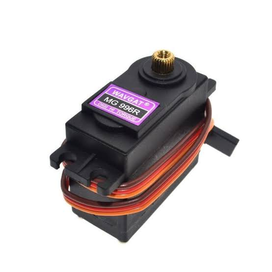
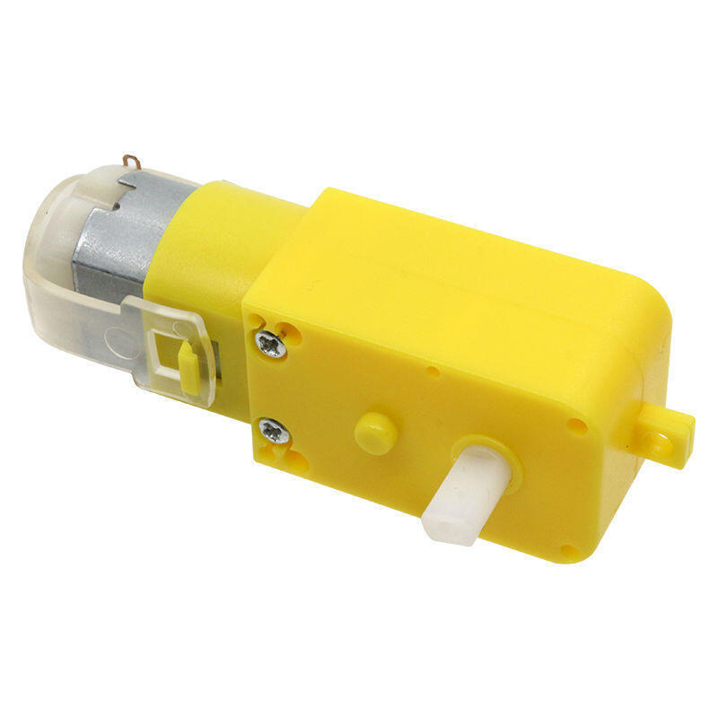
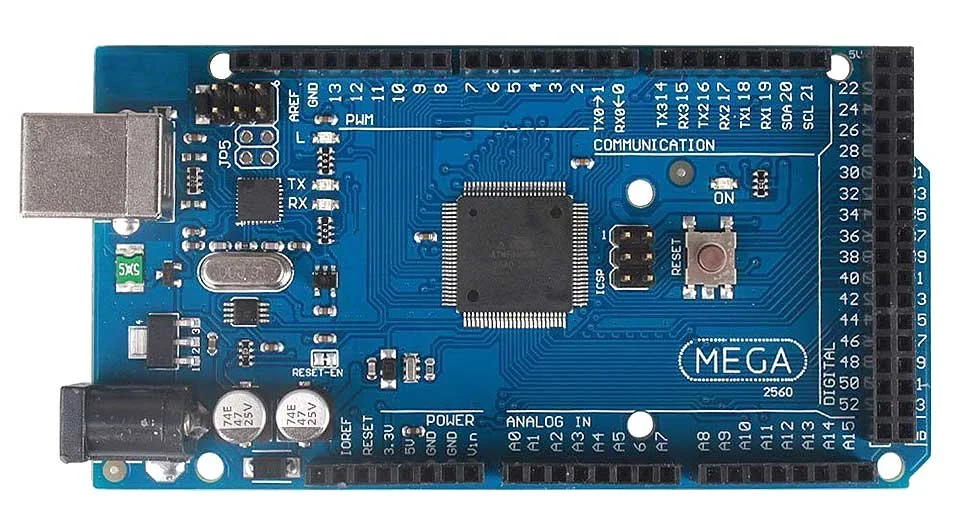
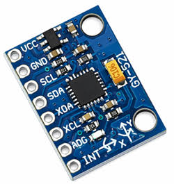

# Índice

# Índice

* [1. Nuestro Equipo](#1-nuestro-equipo)
  * [1.1 Integrantes](#11-integrantes)
  * [1.2 Nuestro Objetivo](#12-nuestro-objetivo)
  * [1.3 Contenido de la carpetas](#13-contenido-de-las-carpetas)
* [2. El Robot y Diseño Mecánico](#2-el-robot-y-diseño-mecánico)
  * [2.1 Chasis y Estructura](#21-chasis-y-estructura)
  * [2.2 Sistema de Dirección](#22-sistema-de-dirección)
  * [2.3 Sistema de Tracción](#23-sistema-de-tracción)
  * [2.4 Impresión 3D y Piezas](#24-impresión-3d-y-piezas)
* [3. Apartado Electrónico](#3-apartado-electrónico)
  * [3.1 Microcontrolador y Sensores](#31-microcontrolador-y-sensores)
  * [3.2 Controlador de Motores](#32-controlador-de-motores)
  * [3.3 Baterías y Alimentación](#33-baterías-y-alimentación)
  * [3.4 Esquemas de Conexión](#34-esquemas-de-conexión)
* [4. Software y Control](#4-software-y-control)
  * [4.1 Visión Artificial](#41-visión-artificial)
  * [4.2 Algoritmo de Navegación](#42-algoritmo-de-navegación)
* [5. Estructura del Repositorio](#5-estructura-del-repositorio)
  * [5.1 Contenido de Carpetas](#51-contenido-de-carpetas)
* [6. Demostración y Pruebas](#6-demostración-y-pruebas)
  * [6.1 Videos del Robot](#61-videos-del-robot)
* [7. Archivos de Fabricación y Diseño](#7-archivos-de-fabricación-y-diseño)
  * [7.1 Archivos CAD y 3D](#71-archivos-cad-y-3d)
  * [7.2 Esquemas Electrónicos](#72-esquemas-electrónicos)
  * [7.3 Slicer Files](#73-slicer-files)

---

## 1. Nuestro Equipo
Somos Kairos, un grupo de estudiantes universitarios dedicados a la robótica, la automatización y la innovación tecnológica. 
### 1.1 Integrantes
<table>
  <tr>
    <td width="30%" valign="top">
      
    </td>
    <td valign="top">
      <h3>Rosalba Rodríguez</h3>
      
🎂 <b>Edad:</b> [21] años

      
🧑‍💻 <b>Rol:</b> Hardware / Electrónica

      

      
🔩 <b>Habilidades:</b>

      <ul>
        <li>Estudiante de Ing. Electrónica (Mención Automatización y Control).</li>
        <li>Desarrollo de sistemas de control para robótica autónoma.</li>
      </ul>
      

    </td>
  </tr>
</table>
<table>
  <tr>
    <td width="30%" valign="top">
      
    </td>
    <td valign="top">
      <h3>Victoria Perozo</h3>
      
🎂 <b>Edad:</b> [20] años

      
🧑‍💻 <b>Rol:</b> Documentación y Hardware / Electrónica

      

      
🔩 <b>Habilidades:</b>

      <ul>
        <li>Estudiante de Ing. Electrónica (Mención Telecomunicaciones).</li>
        <li>Diseño y simulación de circuitos electrónicos.</li>
        <li>Desarrollo de sistemas de control para robótica autónoma.</li>    </td>
  </tr>
</table>
<table>
  <tr>
    <td width="30%" valign="top">
      
    </td>
    <td valign="top">
      <h3>Ayrton Marcano</h3>
      
🎂 <b>Edad:</b> [19] años

      
🧑‍💻 <b>Rol:</b> Programación / Electrónica

      

      
🔩 <b>Habilidades:</b>

      <ul>
        <li>Estudiante de Ing. Informatica.</li>
        <li>Programación de microcontroladores y sensores.</li>
        <li>Desarrollo de sistemas de control para robótica autónoma.</li>
    </td>
  </tr>
</table>

### 1.2 Nuestro Objetivo
Este proyecto tiene como objetivo diseñar, construir y programar un robot autónomo capaz de superar una serie de desafíos de obstáculos para la competición WRO Future Engineers. El equipo Kairos se inspiró en la aplicación de principios de ingeniería y en la resolución creativa y eficiente de problemas, impulsados por la pasión por la innovación y el aprendizaje práctico. 

Buscamos desarrollar un sistema fiable y eficiente que muestre nuestras competencias técnicas y de trabajo en equipo, y que además ofrezca una experiencia formativa profunda. Para lograrlo seguimos un proceso sistemático: investigación, prototipado, pruebas de laboratorio e iteraciones continuas. Mantenemos documentación detallada para facilitar la transferencia de conocimiento y asegurar un flujo de trabajo ordenado a lo largo del proyecto

### 1.3 Contenido de las carpetas
Contenido (Github) 
*t-photos* contiene fotos del equipo

*v-photos* contiene 6 fotos del vehículo desde varios ángulos

*video* contiene el archivo video.md con el enlace a nuestro canal de YouTube y los vídeos correspondientes

*models* es para los archivos 3D que usamos para imprimir nuestras piezas

*other* incluye otros archivos que pueden usarse para entender cómo preparar el vehículo para la competición. Incluye documentación, conjuntos de datos, especificaciones de hardware, protocolos de comunicación, descripciones, etc.

*schemes* contiene diagramas esquemáticos de los componentes electromecánicos que ilustran todos los elementos (componentes electrónicos y motores) utilizados en el vehículo y cómo se conectan entre sí.

*src* contiene código de software de control para todos los componentes programados para participar en la competición

## 2. El Robot y Diseño Mecánico

### 2.1 Chasis y Estructura
Detalles de la estructura del vehículo.

### 2.2 Sistema de Dirección
### Servomotor: MG996R

<table>
  <tr>
    <td width="30%" valign="top" align="center">
       
      
    </td>
    <td valign="top">
      <h4>Especificaciones:</h4>
      <table>
        <tr><td><b>Velocidad de operación</b></td><td>0.14 s/60°</td></tr>
        <tr><td><b>Voltaje de operación</b></td><td>6v DC</td></tr>
        <tr><td><b>Corriente de operación</b></td><td>500 mA – 900 mA</td></tr>
        <tr><td><b>Corriente de bloqueo</b></td><td>2.5 A</td></tr>
        <tr><td><b>Par de bloqueo</b></td><td>11.0 kg·cm</td></tr>
        <tr><td><b>Material de engranajes</b></td><td>metálico</td></tr>
        <tr><td><b>Peso</b></td><td>55 g</td></tr>
        <tr><td><b>Tipo de servo</b></td><td>Estándar / Posicional (180°)</td></tr>
        <tr><td><b>Datasheet</b></td><td><a href="URL_DEL_DATASHEET" target="_blank">MG996R Tower-Pro</a></td></tr>
      </table>
    </td>
  </tr>
</table>

### Dimensión mecánica

Para hacer una buena elección se hizo la comparación con el micro-servo SG90. Aunque ambos se controlan por PWM y tienen un recorrido de 180°, el SG90 usa engranajes de plástico, opera a un voltaje de 4.8V y entrega un torque máximo de apenas 1.8 kg·cm, lo que lo hace más propenso al desgaste en sus engranajes o romperse debido al peso del chasis en movimiento, en cambio, el MG996R ofrece un torque de bloqueo que alcanza aproximadamente 11 kg·cm a 6V, por lo que dispone de un margen de trabajo mucho mayor para vencer la resistencia del sistema de varillas, la fricción del pivote y las irregularidades de la pista, lo que le da la robustez necesaria para mantener la alineación de las ruedas y reducir el desgaste en el sistema de varillas de dirección. 

### *Motivo de la elección:* 

Para la dirección del robot, elegimos el servomotor MG996R de giro estándar, por su buena resistencia mecánica y sus engranajes metálicos, que son importantes para soportar las cargas del eje delantero. Además, su control por PWM facilita conectarlo directamente con el microcontrolador, lo que permite una respuesta rápida y precisa. 

La dirección fue diseñada bajo la geometría Ackermann porque se busca que el robot tenga un giro más suave y eficiente, reduciendo el deslizamiento de las ruedas. A diferencia de un sistema de dirección paralela, esta configuración mejora la maniobrabilidad en espacios pequeños y ayuda a mantener una alineación más exacta al estacionar o esquivar obstáculos. 

### *Justificación técnica:* 

Utilizamos un sistema de dirección Ackermann diseñado y fabricado a medida mediante impresión 3D. Este mecanismo permite que las ruedas delanteras giren con ángulos ligeramente diferentes en cada curva, de modo que ambas sigan trayectorias concéntricas hacia un mismo punto sobre el eje trasero. Esta configuración mejora la estabilidad y la precisión en los giros cerrados. El diseño fue ajustado de forma interactiva en FreeCAD, modificando los puntos de giros y los ángulos de dirección hasta lograr una aproximación adecuada a la configuración Ackermann. 

La calibración del sistema se realizó verificando la posición neutra del servomotor antes del montaje definitivo, es decir, lo primero que se realizó fue conectar el servo al Arduino y ordenarle un ángulo de 90° antes de su montaje, para así asegurar que el motor estuviera centrado y no forzar ni romper las piezas. Con el servo fijo en ese punto, se procedió al montaje del brazo de dirección y acoplamiento de las varillas de la geometría Ackermann intentando que las ruedas delanteras quedaran lo más centradas posible. A partir de esa referencia, se hicieron pruebas en la pista y ajustes en el código para corregir desviaciones y asegurar que el giro a ambos lados fuera simétrico. De esta manera, se aseguró que el sistema quedara centrado y que las correcciones de dirección respondieran con precisión a las órdenes del microcontrolador.  

La geometría Ackermann fue adaptada a las dimensiones y curvas de la pista para asegurar que el vehículo tuviera buena reacción a las curvas cerradas y la mínima pérdida de adherencia posible. Por consiguiente, se ajustaron los ángulos de dirección y la posición de los puntos de giro en el modelo impreso en 3D, buscando que las ruedas delanteras trazaran una trayectoria coherente con el radio de curvatura de la pista durante las maniobras. Este ajuste permitió mejorar la estabilidad del robot, especialmente en cambios de dirección bruscos y en el paso por obstáculos. 
 
### *Cálculos:* 

### Ecuación Fundamental
cot(θ o ) - cot(θ i ) = W / L

W : Distancia entre pivotes de dirección (batalla)
L : Distancia entre ejes

### Relación de Velocidades en Curva
ω o / ω i = (R + W/2) / (R - W/2)

ω o : Velocidad angular de la rueda exterior.
ω i : Velocidad angular de la rueda interior.
R : Radio de giro del centro del eje.

*Montaje:* 

El servomotor está en una plataforma de soporte frontal integrada en el chasis, la cual conecta con el varillaje del mecanismo de dirección.  El diseño modular permite realizar ajustes o cambios de componentes de manera sencilla. 

### 2.3 Sistema de Tracción
### Motor: Motorreductor DC

<table>
  <tr>
    <td width="30%" valign="top" align="center">
       
      
    </td>jp
    <td valign="top">
      <h4>Especificaciones:</h4>
      <table>
        <tr><td><b>Voltaje</b></td><td>12v DC</td></tr>
        <tr><td><b>Velocidad sin carga (RPM)</b></td><td>200rpm</td></tr>
        <tr><td><b>Par de motor de pérdida</b></td><td>1.7 kg-cm</td></tr>
        <tr><td><b>Par máximo de eficiencia</b></td><td>0.34 kg-cm</td></tr>
        <tr><td><b>Relación de cambios</b></td><td>1:100</td></tr>
        <tr><td><b>Corriente nominal</b></td><td>0.04 A</td></tr>
        <tr><td><b>Corriente de pérdida</b></td><td>0.67 A</td></tr>
        <tr><td><b>Material de engranajes</b></td><td>metálico</td></tr>
        <tr><td><b>Datasheet</b></td><td><a href="https://www.bolanosdj.com.ar/MOVIL/ARDUINO2/MotoresConRuedasArd.pdf" target="_blank">MotoresConRuedasArd.pdf</a></td></tr>
      </table>
    </td>
  </tr>
</table>

### Dimensión mecánica

### *Motivo de la elección*

El motorreductor amarillo DC fue seleccionado por su diseño ligero, económico y su facilidad de integración dentro de nuestro chasis. Su caja reductora integrada permite una transmisión directa y eficiente hacia las ruedas, proporcionando el par necesario para mantener una buena tracción en pistas planas dentro de una arquitectura modular.

Al no contar con un encoder (codificador) integrado para el conteo de vueltas, se incorporó un giroscopio que ofrece una retroalimentación de movimiento precisa. Esto asegura que los desplazamientos del robot sean exactos, compensando la ausencia de sensores de efecto Hall y reduciendo el margen de error al tomar curvas cerradas.

### *Justificación técnica* 

Elegimos el motorreductor amarillo DC con su relación de reducción interna (1:48) porque nos ofrece el balance ideal entre torque, velocidad de respuesta y consumo energético. Esta configuración permite alcanzar la velocidad requerida en las ruedas para que los sensores de visión artificial y los sensores ultrasónicos ejecuten la captura y el procesamiento de datos en tiempo real con alta estabilidad, evitando desincronizaciones en las lecturas durante los giros.

Utilizando los modelos de transferencia de torque y considerando el peso total del chasis junto con la fricción de los ejes, los cálculos determinan que el torque requerido para vencer la fricción estática inicial y poner en marcha el robot se encuentra muy por debajo del torque máximo de pérdida especificado para estos motores. Este margen garantiza un factor de seguridad óptimo sobre el torque mínimo de arranque, asegurando que los motores operen de forma continua en su zona de mayor eficiencia sin sobrecalentamiento.

### *Diferencial de engranaje (Diseño principal)*

Originalmente se diseñó un sistema de engranajes diferencial impreso en 3D para ser acoplado al conjunto del motorreductor amarillo. Este mecanismo permitiría que las ruedas traseras (izquierda y derecha) giraran a velocidades independientes durante las curvas, optimizando el desplazamiento fluido y mejorando la estabilidad del robot en giros exigentes. Sin embargo, debido a fallos en la manufactura de las piezas mecánicas, no fue posible su implementación en el prototipo final.
Solución del diseño

Durante la fase de ensamblaje se identificó un error de tolerancia en la impresión de los engranajes internos del diferencial (el anillo y los piñones satélite). Ante la imposibilidad de reimprimir estas piezas a tiempo para las pruebas, se sustituyó la caja del diferencial por un sistema de transmisión de eje rígido directo.

Aunque esta modificación elimina la capacidad mecánica de variar la velocidad entre ambas ruedas al girar, el efecto se compensa a través de código: el software utiliza los datos del giroscopio para ajustar la aceleración y gestionar electrónicamente la trayectoria del vehículo en las curvas.

### 2.4 Impresión 3D y Piezas
Descripción de piezas diseñadas e impresas.

## 3. Apartado Electrónico
### 3.1 Microcontrolador y Sensores
### Microcontrolador: Arduino Mega2560

<table>
  <tr>
    <td width="30%" valign="top" align="center">
       
      
    </td>
    <td valign="top">
      <h4>Especificaciones:</h4>
      <table>
        <tr><td><b>Microcontrolador</b></td><td>ATmega2560</td></tr>
        <tr><td><b>Coprocesador Inalámbrico</b></td><td>ESP8266 integrado (Para conectividad WiFi)</td></tr>
        <tr><td><b>Voltaje de operación</b></td><td>5 V DC</td></tr>
        <tr><td><b>Voltaje de Entrada</b></td><td>7V a 12V DC</td></tr>
        <tr><td><b>Pines I/O Digitales</b></td><td>54 (de los cuales 15 proporcionan salida PWM)</td></tr>
        <tr><td><b>Pines de Entrada Analógica</b></td><td>16</td></tr>
        <tr><td><b>Memoria Flash</b></td><td>256 KB (de los cuales 8 KB son usados por el bootloader)</td></tr>
        <tr><td><b>Memoria SRAM / EEPROM</b></td><td>8 KB / 4 KB</td></tr>
        <tr><td><b>Datasheet</b></td><td><a href="https://admin.arsbook.it/stempdf/LS-ELEGOO-MEGA.pdf" target="_blank">LS-ELEGOO-MEGA.pdf</a></td></tr>
      </table>
    </td>
  </tr>
</table>

### Motivo de la selección

El Arduino Mega 2560 actúa como el cerebro central de procesamiento de nuestro robot. Su arquitectura basada en el microcontrolador ATmega2560 ofrece una ejecución de muy baja latencia, lo cual resulta indispensable para responder en tiempo real a las lecturas del giroscopio MPU6050, el procesamiento del sistema de visión artificial y la evasión instantánea de obstáculos mediante los sensores ultrasónicos.

Elegimos esta tarjeta debido a la alta demanda de recursos de nuestra arquitectura electrónica y de control. Al integrar simultáneamente la cámara de visión artificial, los sensores ultrasónicos, el módulo IMU MPU6050, el servomotor de dirección y el driver de tracción, placas más compactas habrían agotado rápidamente sus pines disponibles y su memoria de trabajo. Además, este modelo incorpora un coprocesador inalámbrico ESP8266 integrado, lo que nos otorga conectividad WiFi para la transmisión de telemetría sin recargar las tareas principales del procesador central. Sus 54 pines digitales, 16 entradas analógicas y 4 puertos UART por hardware nos dan total libertad para mantener un esquema de cableado modular, ordenado y directo.

### Comparación con Arduino Uno y Nano

Al comparar la tarjeta seleccionada con un Arduino Uno o Nano tradicional, la diferencia más crítica radica en la capacidad de memoria y procesamiento. El Arduino Mega 2560 cuenta con 256 KB de memoria Flash y 8 KB de memoria SRAM, lo que representa hasta ocho veces más espacio para alojar algoritmos de control de trayectoria, cálculos de visión y librerías complejas sin correr el riesgo de colapsar la memoria del sistema durante la ejecución en pista.

Otra ventaja determinante es la disponibilidad de periféricos por hardware. Mientras que placas como el Uno poseen un solo puerto serie, el Mega 2560 ofrece 4 puertos UART independientes por hardware, lo que permite la comunicación simultánea con la cámara de visión y el monitor de depuración sin recurrir a emulaciones por software. Asimismo, sus 54 pines de entrada/salida digital evitan la saturación del controlador al conectar múltiples sensores y actuadores de forma dedicada, sumado a la conectividad WiFi integrada mediante el chip ESP8266 que no está presente en los modelos convencionales.

### Justificación de la ubicación

El Arduino Mega 2560 se posicionó en el centro geométrico del chasis con el objetivo principal de garantizar su protección estructural. Al ubicarse en la zona interna más resguardada del vehículo, la tarjeta queda protegida frente a posibles colisiones directas o roces accidentales contra las paredes del circuito durante la navegación.

Adicionalmente, esta posición estratégica optimiza la distribución general del cableado. Estar en el centro minimiza la distancia física hacia los componentes de la sección frontal (como la cámara de visión, el servomotor de dirección y los sensores ultrasónicos) y hacia la sección trasera (donde se encuentran el driver de potencia y el motor de tracción). Esto no solo ayuda a reducir el peso total de los cables y a equilibrar las masas del robot, sino que también disminuye notablemente el riesgo de interferencias electromagnéticas en las líneas de transmisión de datos.
Cámara, MPU6050, sensores ultrasónicos, etc.

### Sensor Ultrasónico: HC-SR04

<table>
  <tr>
    <td width="30%" valign="top" align="center">
       
      
    </td>
    <td valign="top">
      <h4>Especificaciones:</h4>
      <table>
        <tr><td><b>Modelo</b></td><td>HC-SR04</td></tr>
        <tr><td><b>Voltaje</b></td><td>5 V DC</td></tr>
        <tr><td><b>Corriente de trabajo</b></td><td>15 mA</td></tr>
        <tr><td><b>Corriente de reposo</b></td><td>&lt; 2mA</td></tr>
        <tr><td><b>Rango de medición</b></td><td>2 cm a 400 cm</td></tr>
        <tr><td><b>Ángulo de apertura</b></td><td>&lt; 15° (Cono de medición)</td></tr>
        <tr><td><b>Datasheet</b></td><td><a href="URL_DEL_DATASHEET" target="_blank">ULTRASONIC-HC-SR04.PDF</a></td></tr>
      </table>
    </td>
  </tr>
</table>

### Dimensiones mecánicas

### Motivo de la elección: 

Hemos integrado dos sensores ultrasónicos para la navegación en entornos con obstáculos, estos sensores son importantes para la detección de distancias de seguridad para evitar colisiones. El funcionamiento de estos dispositivos se basa en la emisión de pulsos sonoros y la medición del tiempo de retorno, lo que permite calcular la distancia a paredes o pilares con alta precisión, sin depender de las condiciones de luz, proporcionando seguridad para tareas como el aparcamiento en paralelo. 

Estos sensores ofrecen una ventaja competitiva frente a los infrarrojos, ya que al no depender de la iluminación del entorno permite una detección constante sobre cualquier tipo de material. Además, al tener una fácil conexión con el microcontrolador, permite una rápida integración. 

### Justificación de la ubicación: 

La aplicación de los ultrasónicos consta de tres sensores posicionados a los costados y al frente del robot, uno en el lado izquierdo y otro en el lado derecho. Esta distribución se aplica para compensar las zonas ciegas y complementar el campo de visión de la cámara. 

Al colocar la cámara en la parte frontal para el reconocimiento de colores y líneas de carrera, sus laterales se convierten en puntos ciegos en el campo de visión, debido al ángulo de su lente. Por ello, se decidió colocar los sensores posicionados hacia los laterales y al frente, para que cubran los puntos críticos de visión durante el recorrido, esta configuración nos ayuda a ejecutar maniobras como el aparcamiento en paralelo o la evasión de pilares en curvas cerradas, ya que permite medir la distancia de las paredes de la pista.

### Sensor de Orientación: Giroscopio

<table>
  <tr>
    <td width="30%" valign="top" align="center">
       
      
    </td>
    <td valign="top">
      <h4>Especificaciones:</h4>
      <table>
        <tr><td><b>Modelo</b></td><td>MPU6050 (Acelerómetro + Giroscopio de 6 ejes)</td></tr>
        <tr><td><b>Voltaje</b></td><td>3.3 V a 5 V DC</td></tr>
        <tr><td><b>Corriente de operación</b></td><td>3.9 mA</td></tr>
        <tr><td><b>Protocolo de comunicación</b></td><td>I2C (pines SDA y SCL)</td></tr>
        <tr><td><b>Convertidores Analógico-Digital (ADC)</b></td><td>De 16 bits para cada eje</td></tr>
        <tr><td><b>Datasheet</b></td><td><a href="URL_DEL_DATASHEET" target="_blank">ps-mpu-6000a-00-mpu-6000-and-mpu-6050-datasheet.pdf</a></td></tr>
      </table>
    </td>
  </tr>
</table>

### Diagrama de bloque interno 

### Motivo de la selección

El módulo MPU6050 es de suma importancia para la navegación y el control de rumbo de nuestro robot, especialmente debido a que nuestra configuración de tracción con el motorreductor amarillo DC no cuenta con encoders para medir directamente las revoluciones o vueltas de las ruedas, ante esta limitación, la Unidad de Medida Inercial (IMU) proporciona lecturas en tiempo real sobre la velocidad angular y el ángulo de orientación (yaw), permitiendo que el sistema realice correcciones continuas para mantener el rumbo o ejecutar giros exactos.

Elegimos el MPU6050 por ser una solución compacta e integral, ya que reúne en un solo chip un giroscopio de 3 ejes y un acelerómetro de 3 ejes, ofreciendo un sistema de navegación inercial completo de 6 grados de libertad (6-DOF). La mayor ventaja técnica de este módulo es su procesador interno Digital Motion Processor (DMP), el cual ejecuta de forma autónoma los cálculos matemáticos pesados para el filtrado de ruido y fusión de datos. Gracias a esto, el MPU6050 entrega los datos de orientación ya procesados y limpios, liberando de esa carga de trabajo a nuestro Arduino Mega 2560.

### Comparación con otras alternativas de orientación

Al comparar el MPU6050 con el uso de sensores individuales o con brújulas digitales magnéticas (como el HMC5883L), el MPU6050 presenta ventajas superiores de integración y precisión en robótica móvil. Las brújulas magnéticas son altamente susceptibles a las interferencias electromagnéticas generadas por el propio motorreductor amarillo DC en funcionamiento y por el cableado de potencia, lo que provoca desviaciones severas en la lectura de dirección. Al ser puramente inercial, el MPU6050 no se ve afectado por campos magnéticos externos.

Por otro lado, implementar sensores de inclinación o aceleración independientes requeriría mayor cableado en el bus I2C y obligaría al microcontrolador a ejecutar manualmente algoritmos de filtrado pesados (como el filtro de Kalman o complementario), consumiendo memoria y ciclos de procesamiento. El MPU6050 resuelve esto mediante su DMP interno, representando la opción más equilibrada entre precisión, bajo consumo y eficiencia de procesamiento.

### Justificación de la ubicación

El MPU6050 se ubicó en la zona central del chasis, situándose lo más cerca posible del centro de masa y del eje geométrico de rotación del robot. Esta ubicación es crítica, ya que situar el giroscopio lejos del centro de giro introduce aceleraciones centrípetas parasitarias durante las curvas, deformando las lecturas.
Adicionalmente, al estar montado de forma rígida sobre una sección estable del chasis, se reducen las vibraciones mecánicas generadas por el motorreductor amarillo y la rodadura, asegurando una transmisión constante de datos estables a través de las líneas de comunicación I2C.

### 3.2 Controlador de Motores
Drivers de motores utilizados.

### 3.3 Baterías y Alimentación
Sistema de energía y regulación.

### 3.4 Esquemas de Conexión
Diagramas de cableado.

## 4. Software y Control

### 4.1 Visión Artificial
Procesamiento de imagen y detección de señales/líneas.

### 4.2 Algoritmo de Navegación
Lógica de esquivar obstáculos y recorrido.

## 5. Estructura del Repositorio

### 5.1 Contenido de Carpetas
Explicación de carpetas como models, schemes, t-photos, v-photos, video, etc.

## 6. Demostración y Pruebas

### 6.1 Videos del Robot
Enlaces a pruebas y funcionamiento en pista.

## 7. Archivos de Fabricación y Diseño

### 7.1 Archivos CAD y 3D
Archivos .step o .stl ubicados en la carpeta models.

### 7.2 Esquemas Electrónicos
Diagramas esquemáticos en PDF o imagen.

### 7.3 Slicer Files
Archivos de laminación (.gcode, .3mf o .3fd) listos para impresión 3D.
---

#### 2.2.1 Impresión 3D
Detalles sobre impresión 3D.

# Introducción
En este repositorio se encuentra la documentación completa de nuestro trabajo para la categoría Future Engineers: desde el diseño mecánico y la selección de componentes, hasta el desarrollo del software, los protocolos de prueba y la evolución de nuestro prototipo.
